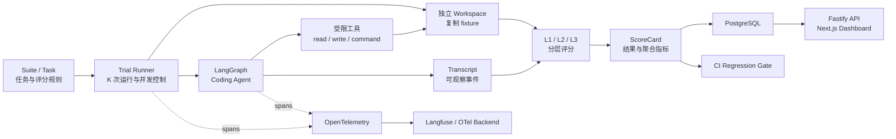
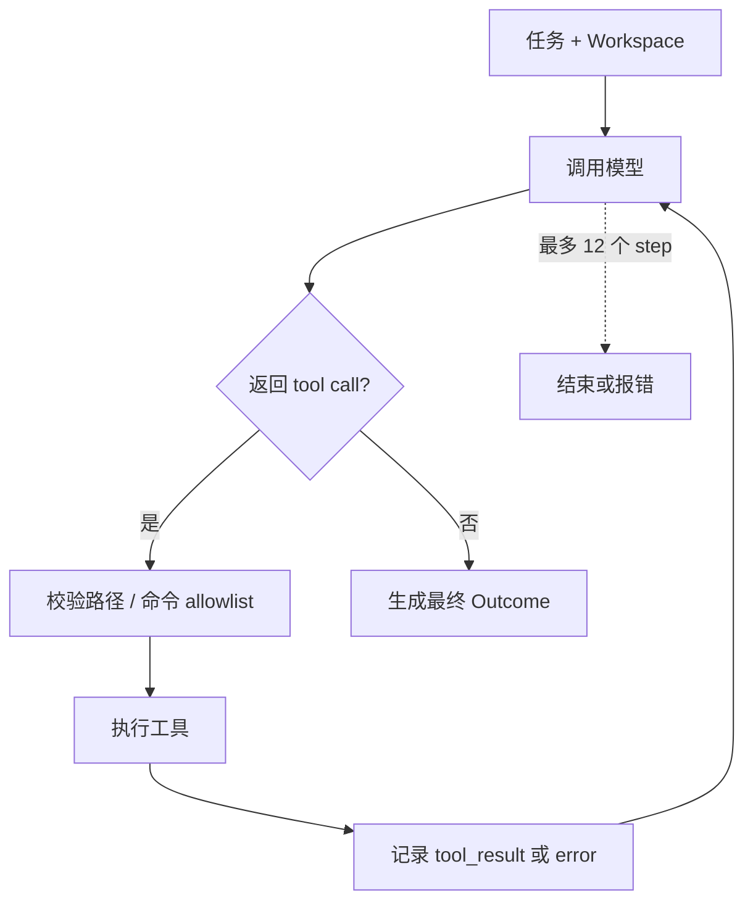
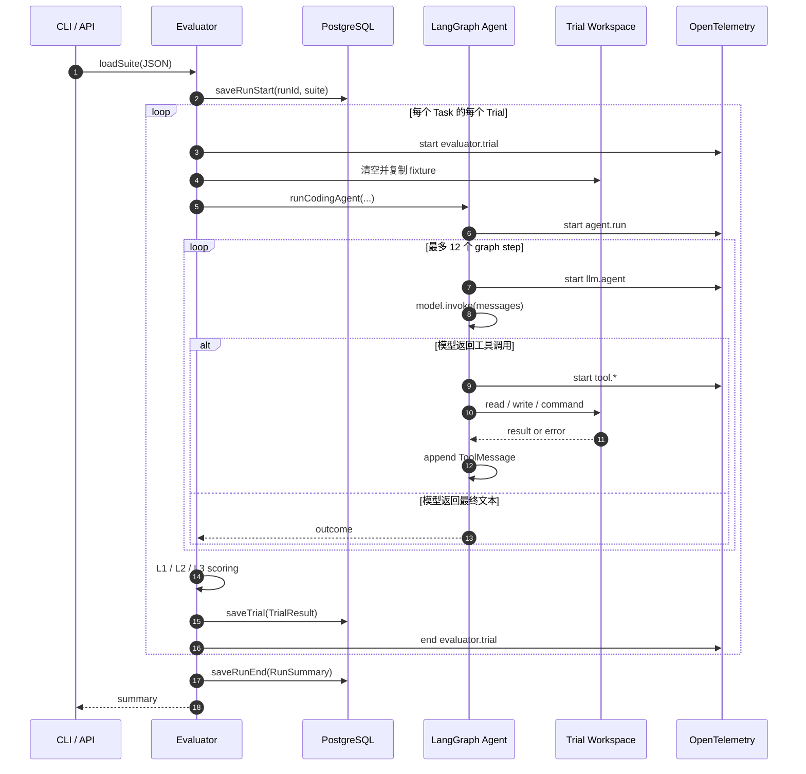
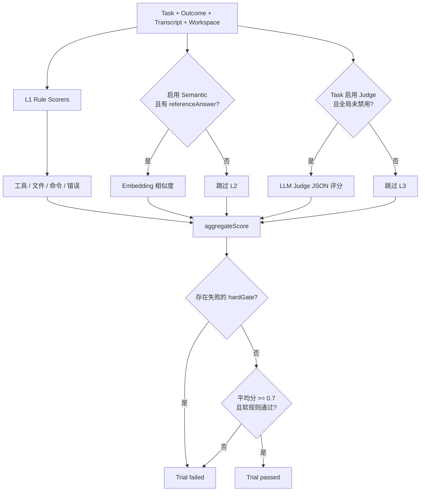

# Agent Evaluation Platform：从多次 Trial、分层评分到 OpenTelemetry + Langfuse

项目源码：[github.com/fengnovo/agent-eval-platform-otel-langfuse](https://github.com/fengnovo/agent-eval-platform-otel-langfuse)

做一个能修改代码的 Agent 并不难，难的是回答后面这些问题：

- 它是真的修好了问题，还是刚好生成了一段看起来合理的答案？
- 同一道题重复运行几次，结果是否稳定？
- 文件写对了，但测试没通过，应该怎么算分？
- 失败发生在模型推理、工具调用、命令执行，还是评分阶段？
- 换模型、改 Prompt 或升级 Agent 后，能力有没有回退？

`agent-eval-platform-otel-langfuse` 是一套可运行的 Coding Agent 评测参考项目。它用 TypeScript 和 LangGraph 实现 Agent，用分层 Scorer 判断结果，用 PostgreSQL 保存评测数据，再通过 OpenTelemetry 和 Langfuse 把一次 Trial 的执行过程完整串起来。

这套系统真正关注的不是“Agent 能不能跑一次”，而是如何把 Agent 的表现变成一组可以重复、解释、比较和拦截回归的工程数据。

## 先看完整链路

整套评测从 Suite 中的一道 Task 开始。同一道题会重复执行 K 次，每一次都在独立 workspace 中运行，生成自己的 Transcript、Outcome、ScoreCard 和 Trace。



可以把它理解成五个连续的问题：

1. `Task` 定义要考什么。
2. `Trial` 负责把题目真正跑起来。
3. `Transcript` 记录发生了什么。
4. `Scorer` 判断做得对不对。
5. `OpenTelemetry + Langfuse` 解释它为什么得到这个结果。

评估和可观测性在这里是互补关系：Evaluator 给出结论，Trace 提供过程证据。

## 为什么不能只看最终回答

Coding Agent 的最终文本很容易产生错觉。它可能说“已经修复并通过测试”，但实际上没有读过目标文件、没有写入任何修改，甚至没有执行测试。

因此，这个平台不会只保存最后一句话，而是记录一份可观察的 Transcript：

```text
llm_start / llm_end
tool_call / tool_result
error
```

这些事件足以回答几个关键问题：

- Agent 是否使用了任务要求的工具？
- 它实际读写了哪些文件？
- 验证命令是否真正执行，退出码是什么？
- 工具调用或模型调用在哪一步失败？
- 一次 Trial 花了多长时间、消耗了多少 token？

Transcript 记录的是外部可观察行为，不保存、也不依赖模型隐藏的 Chain-of-Thought。这样既能为评分和排障提供证据，也避免把不可验证的内部推理当成系统事实。

## Suite、Task 与 K 次独立 Trial

评测数据集放在 `suites/` 中。一份 Suite 可以包含多道 Task，每道 Task 同时描述任务输入、初始 fixture、预期行为和评分配置。

仓库中的第一套试卷是 `suites/coding-agent.json`。它会把一个带 Bug 的 TypeScript 工程复制到 Trial workspace，再要求 Agent 修复问题，并验证：

```text
required tool: read_file
required tool: write_file
required tool: run_command
hard gate: pnpm typecheck == 0
hard gate: pnpm test == 0
L3: LLM Judge >= 0.75
```

新增题目时，只需继续追加 JSON：

```json
{
  "id": "task-id",
  "name": "Task name",
  "fixture": "fixtures/your-project",
  "input": "具体任务",
  "expected": {
    "requiredTools": ["read_file", "write_file", "run_command"],
    "filesMustExist": ["src/index.ts"],
    "validationCommands": ["pnpm typecheck", "pnpm test"]
  },
  "scoring": {
    "llmJudge": true,
    "judgeThreshold": 0.8
  }
}
```

同一道 Task 不是只执行一次，而是展开为 K 个 Trial：

```text
Task
├─ Trial 0 -> workspace 0 -> result 0 -> traceId A
├─ Trial 1 -> workspace 1 -> result 1 -> traceId B
└─ Trial 2 -> workspace 2 -> result 2 -> traceId C
```

这么做是因为模型输出和工具路径具有随机性。单次成功只能证明“这次做对了”，多次 Trial 才能进一步得到 pass rate、平均分和 P95 latency，观察能力的稳定性与性能尾部。

每次 Trial 都会先清空并复制 fixture，彼此不共享文件修改。否则第一次运行留下的修复结果可能让后续 Trial 直接通过，评测数据也就失去了意义。

## Coding Agent：能力有限，边界明确

Agent 基于 LangGraph 构建，核心工具只有三个：

| 工具 | 作用 | 边界 |
| --- | --- | --- |
| `read_file` | 读取工程文件 | 路径必须位于当前 Trial workspace |
| `write_file` | 写入修复内容 | 路径必须位于当前 Trial workspace |
| `run_command` | 执行验证命令 | 只能运行 allowlist 中允许的命令前缀 |

Agent 最多执行 12 个 graph step。每一轮模型可能返回最终文本，也可能发起工具调用；工具结果会以 `ToolMessage` 追加回消息列表，再进入下一轮模型调用。



文件工具通过 `assertInsideWorkspace` 拒绝路径逃逸，`run_command` 在 Trial workspace 内执行，并受到命令 allowlist 和超时控制。这个边界很适合本地或内部评测，但它仍然使用本机 `child_process`，不等同于生产级执行沙箱。

## Monorepo 的模块分工

项目把 Agent、评估、持久化、可观测性和产品界面拆成独立 package 与 app：

```text
apps/
  api/                  Fastify API
  web/                  Next.js Dashboard
packages/
  agent/                LangGraph Coding Agent、工具与轨迹
  evaluator/            Trial Runner、L1/L2/L3 Scorer 与聚合
  db/                   PostgreSQL 持久化
  shared/               Schema 与共享类型
  telemetry/            OpenTelemetry SDK 与 exporter
fixtures/               每道题的初始工程快照
suites/                 评测数据集
scripts/run-eval.ts      CLI 与 CI regression gate 入口
.github/workflows/       PR 回归门禁
```

模块边界也很清晰：

| 模块 | 负责 | 不负责 |
| --- | --- | --- |
| `packages/shared` | 用 Zod 定义 Suite、Task 和结果类型 | 不执行 Agent，不连接数据库 |
| `packages/agent` | 操作隔离目录、调用模型和工具、记录轨迹 | 不决定任务是否通过 |
| `packages/evaluator` | 创建 Trial、运行 Agent、评分、聚合指标 | 不提供 HTTP 服务 |
| `packages/evaluator/src/scorers` | L1 规则、L2 语义、L3 Judge | 不持久化结果 |
| `packages/db` | 初始化表结构，保存 Run 与 Trial | 不执行评测逻辑 |
| `packages/telemetry` | 初始化 OTel、创建 Span、flush 与 shutdown | 不改变评测结果 |
| `apps/api` | 提供启动评测和查询结果的 REST API | 不实现评分算法 |
| `apps/web` | 展示 Run、Trial、Transcript、评分与 Trace 链接 | 不在浏览器里执行 Agent |

这种拆分有一个很实用的好处：评分系统和观测系统都是旁路能力。它们可以读取 Agent 的行为和结果，但不会侵入或偷偷改变 Agent 本身的任务逻辑。

## 一次评测是怎么执行的

从 CLI 或 API 触发 Suite 后，Evaluator 是整条链路的核心编排者：



Agent、验证命令和 Trial 都有超时控制。子进程超时会被终止；Agent 抛错或 Trial 超时时，Evaluator 会加入一个失败的 `trial_error` hard gate，而不是让异常从统计中悄悄消失。

## L1、L2、L3：把确定性与主观判断分开

不同类型的结果不适合用同一种评分方式。平台将评分拆成三层：

### L1：规则评分

L1 处理能够确定验证的事情，包括：

- 是否使用必需工具或触发禁用工具；
- 目标文件是否存在；
- 输出是否包含要求的关键词；
- typecheck、test 等命令的退出码是否为 0；
- Agent 执行命令时发生了多少次失败。

这层成本低、可重复、结果稳定，适合承担最关键的工程约束。

### L2：语义相似度

当 `ENABLE_SEMANTIC_SCORER=1` 且题目提供 `referenceAnswer` 时，L2 会用 Embedding cosine similarity 比较结果与参考答案。

它比关键词规则更能容忍表达差异，但语义相似并不等于程序正确，所以 L2 更适合作为补充分，而不是代替测试。

### L3：LLM-as-a-Judge

当 Task 开启 `llmJudge` 且全局未禁用 Judge 时，L3 会让另一个模型按要求输出 JSON 评分。

它适合判断解释质量、任务完成度等难以完全规则化的维度，但也可能随 Judge 模型、Prompt 或上下文变化而漂移。因此，生产环境还需要 calibration set 来校准 Judge。

## Hard Gate：高分不能覆盖硬失败

评分系统最重要的设计不是“支持 LLM Judge”，而是明确高分也不能绕过哪些失败。



Build、Test、文件存在性等条件可以配置为 Hard Gate。一旦硬约束失败，即使 L2 或 L3 给出很高的分数，Trial 仍然失败。

这是 Coding Agent 评测必须守住的底线：自然语言判断负责补充质量信息，机器可验证的工程事实拥有最终否决权。

## 从 Trial 到聚合指标

单个 Trial 会产出 ScoreCard，包含是否通过、总分和各评分项明细；同一 Suite 的多个 Trial 再聚合为运行级指标：

- `pass rate`：重复运行中真正通过的比例；
- `avg score`：总体质量水平；
- `P95 latency`：关注最慢一批请求，而不只看平均耗时。

这些指标会保存到 PostgreSQL，并通过 Fastify API 与 Next.js Dashboard 提供查询和展示。结果不再只存在于一次性的终端输出中，而是可以按 Run、Task 和 Trial 回溯。

如果把 Dataset、Agent、Prompt 和 Model 也版本化，同一 Suite 就可以用于 A/B 对比：

```text
相同 Suite + 不同 Agent Version
相同 Suite + 不同 Prompt Version
相同 Suite + 不同 Model Version
```

这样模型升级或 Agent 重构是否真的变好，就能用同一套试卷和统计口径回答。

## OpenTelemetry：让评测过程可追踪

每个 Trial 都是一条独立 root trace，而不是把 K 次运行挤进同一个 Trace：

```text
evaluator.trial
├─ agent.run
│  ├─ llm.agent
│  ├─ tool.read_file
│  ├─ llm.agent
│  ├─ tool.write_file
│  ├─ llm.agent
│  └─ tool.run_command
└─ evaluator.score
```

`packages/telemetry` 统一管理 OpenTelemetry NodeSDK、Exporter、Span helper、flush 和 shutdown。业务代码只调用 `withTelemetrySpan(...)`，不会在每个 package 中重复初始化 SDK。

Span 会携带 `run_id`、`trial_id`、`task_id` 和 `trial_index` 等 metadata。Trial 对应的 `traceId` 同时写入 `eval_trials.trace_id`，Dashboard 因此可以从评分结果直接跳到 Langfuse 查看完整执行轨迹。

这条关联解决了一个很常见的问题：指标系统告诉你“第 2 次 Trial 失败了”，而 Trace 系统能立刻展开这一次运行，定位是模型没有调用工具、工具报错、命令超时，还是评分阶段出了问题。

## 两种 Trace 出口

平台支持两种互斥的导出模式。

### 模式 A：SDK 直写 Langfuse

```text
Agent / Evaluator
      ↓
OpenTelemetry SDK
      ↓ LangfuseSpanProcessor
Langfuse
```

本地第一次验证适合用这个模式：

```env
TELEMETRY_ENABLED=1
TELEMETRY_EXPORTER=langfuse
OTEL_SERVICE_NAME=agent-eval-platform

LANGFUSE_PUBLIC_KEY=pk-lf-xxx
LANGFUSE_SECRET_KEY=sk-lf-xxx
LANGFUSE_BASE_URL=https://cloud.langfuse.com
LANGFUSE_TRACING_ENVIRONMENT=development
```

然后运行：

```bash
pnpm install
pnpm telemetry:smoke
pnpm eval
```

`telemetry:smoke` 会输出新建 Trace 的 `traceId`，可先用它确认 Langfuse 凭据与网络链路是否正确。

### 模式 B：经 OTel Collector 转发

```text
Agent / Evaluator
      ↓
OpenTelemetry SDK
      ↓ OTLP/HTTP
OTel Collector
      ├─ Langfuse
      ├─ Tempo
      └─ 其他 OTel Backend
```

当系统需要连接多个后端，或希望统一处理采样、重试与导出策略时，可以把出口改为 OTLP：

```env
TELEMETRY_ENABLED=1
TELEMETRY_EXPORTER=otlp
OTEL_EXPORTER_OTLP_TRACES_ENDPOINT=http://localhost:4318/v1/traces

LANGFUSE_OTEL_ENDPOINT=https://cloud.langfuse.com/api/public/otel
LANGFUSE_OTEL_AUTH=Basic <base64-credentials>
```

启动 PostgreSQL 和 Collector：

```bash
docker compose \
  -f docker-compose.yml \
  -f docker-compose.otel-langfuse.yml \
  --profile otel \
  up -d
```

`TELEMETRY_EXPORTER` 会确保 `langfuse` 和 `otlp` 两条出口互斥。Collector 已经转发到 Langfuse 时，不应再启用 direct exporter，否则同一 Trace 会被写入两次。

如果只想验证 Collector，可以使用项目里的 debug 配置，让 Span 只打印到 Collector 日志，不发送给 Langfuse。

## 内容采集与隐私

可观测平台最容易被忽略的问题，是 Trace 本身也可能成为敏感数据出口。

项目默认配置为：

```env
TELEMETRY_CAPTURE_CONTENT=0
```

此时只记录 Trace/Span 名称、耗时、模型与工具名称、Run/Task/Trial 标识、成功或失败状态，以及模型 SDK 能返回的 token usage。

只有显式开启：

```env
TELEMETRY_CAPTURE_CONTENT=1
```

任务输入、工具输入输出和 LLM 输入输出才会写入 `langfuse.observation.input/output`。

生产环境通常应保持关闭，除非已经明确代码、用户数据和密钥的脱敏方案，以及 Langfuse 中的数据保留和访问控制策略。

## 本地启动

项目要求 Node.js 22+、pnpm 10+ 和 Docker。

```bash
cp .env.example .env
# 填入 OPENAI_API_KEY、OPENAI_BASE_URL、AGENT_MODEL、JUDGE_MODEL

docker compose up -d
pnpm install
pnpm typecheck
pnpm eval
```

如果使用百炼等 OpenAI-compatible endpoint，只需替换 `.env` 中的 Base URL、API Key 与模型名。

本地 PostgreSQL 映射到 `127.0.0.1:5433`，避免和已有的 5432 端口冲突。启动 Dashboard 与 API：

```bash
pnpm dev
```

- Web：`http://localhost:3030`
- API：`http://localhost:3031`

如果还要验证 Langfuse 直连链路，再补充对应的 `LANGFUSE_*` 变量并运行：

```bash
pnpm telemetry:smoke
```

## 把评测变成 CI Regression Gate

一次离线评测只能告诉你当前版本表现如何，真正有工程价值的是把同一套 Suite 放进持续集成。

项目通过 `.github/workflows/` 和 `scripts/run-eval.ts` 支持 PR regression gate：当 Agent、Prompt 或模型配置发生变化时，CI 重新执行评测，并按阈值决定是否允许合并。

初始门禁可以使用全局通过率，例如 80%；进一步产品化时，更合理的策略是按风险分层：

```text
核心任务：通过率必须 100%
普通任务：通过率不得低于 90%
成本：不得超过基线阈值
P95 latency：不得明显退化
```

还可以为 pass rate 和 score 加 Wilson interval 或 bootstrap 置信区间，避免 Trial 数量较少时，被偶然波动误导。

## 安全边界与生产化方向

当前实现适合作为本地或内部参考，但不能直接把不可信用户输入暴露给执行器。即使工具被限制在 workspace、命令受到 allowlist 约束，本机 `child_process` 仍不是真正的安全隔离。

面向公网或多租户时，需要继续补齐：

1. 把命令执行迁移到 Docker、gVisor 或 Firecracker 沙箱，并限制 CPU、内存、网络、时间和文件系统。
2. 为 Dataset、Agent、Prompt、Model 建立明确版本，支持可复现的横向比较。
3. 使用 calibration set 校准 LLM Judge，降低模型升级引起的评分漂移。
4. 从线上失败 Trace 自动沉淀 regression task，让真实问题回流到 Suite。
5. 为 pass rate、score、成本和延迟建立分级回归阈值。
6. 在开启内容采集前完成脱敏、权限与数据保留策略。

## 最后总结

这套平台最值得复用的不是某一个框架，而是它对评测职责的拆分：

```text
Suite 定义考题
Trial 提供可重复实验
Workspace 隔离每次执行
Transcript 保存外部可观察行为
Scorer 判断结果是否正确
Hard Gate 守住工程底线
OpenTelemetry 统一采集过程
Langfuse 解释 Agent 如何运行
PostgreSQL 与 Dashboard 保存和展示结果
CI Gate 阻止能力回归
```

Evaluator 回答“Agent 做得对不对”，OpenTelemetry 与 Langfuse 回答“Agent 到底是怎么运行的”。当结果判断、过程证据和持续回归连成一条链，Agent 才从一次性的 Demo 变成可以持续演进的工程系统。

完整代码与配置见：[Agent Evaluation Platform on GitHub](https://github.com/fengnovo/agent-eval-platform-otel-langfuse)。
