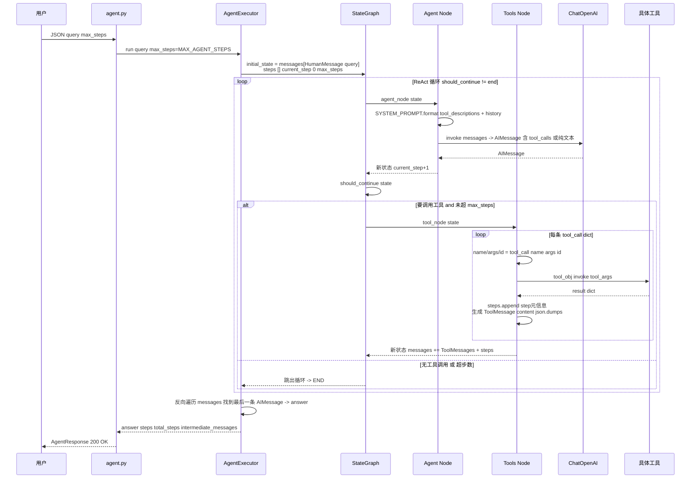

# 项目 4：Agent 任务助手

> 项目源码：[fengnovo/llm-projects](https://github.com/fengnovo/llm-projects)

> 进阶级项目 · LangGraph + ReAct 模式 + 多工具调用

## 项目简介

一个基于 LangGraph 的智能 Agent，采用 ReAct（推理 + 行动）模式，能够自主思考、选择工具、执行操作，一步步解决复杂问题。

## 技术栈

- **LangGraph**：Agent 状态流编排（循环、分支、持久化）
- **LangChain**：工具封装、消息抽象
- **FastAPI**：Web 服务
- **OpenAI 兼容模型**：需要支持 Function Calling

## 核心功能

- ✅ ReAct 模式（思考 → 行动 → 观察 → 循环）
- ✅ 5 个内置工具（计算器、搜索、时间、代码执行、翻译）
- ✅ LangGraph 状态图管理
- ✅ 最大步数限制（防止死循环）
- ✅ 执行步骤可视化
- ✅ 可扩展的工具系统

## 快速开始

```bash
cd 04-agent-task-assistant/backend

python -m venv venv
source venv/bin/activate
pip install -r requirements.txt
cp .env.example .env       # 填入 API Key
python -m app.main
```

- 后端：http://localhost:8002
- API 文档：http://localhost:8002/docs
- 前端：直接打开 `frontend/index.html`

## 可以测试的问题

1. **数学计算**：`计算 1234 * 5678 的结果`
2. **时间查询**：`现在几点了？今天星期几？`
3. **联网搜索**：`搜索一下 LangChain 是什么`
4. **翻译**：`把 Hello World 翻译成中文`
5. **代码执行**：`用 Python 写一个斐波那契函数并测试前 10 项`
6. **多步任务**：`现在是星期几？再计算从 1 加到 100 的和`

## 核心概念

### ReAct 模式

ReAct = Reasoning + Acting（推理 + 行动）

```
用户问题
  ↓
Thought（思考）：我需要做什么？
  ↓
Action（行动）：调用某个工具
  ↓
Observation（观察）：工具返回结果
  ↓
Thought（再思考）：结果够不够？还要做什么？
  ↓
... 循环 ...
  ↓
Final Answer（最终答案）
```

### LangGraph 状态图

为什么用 LangGraph 而不是普通的 Chain？

- **支持循环**：Agent 可以反复调用工具（Chain 是线性的）
- **支持分支**：根据条件走不同路径
- **状态管理**：每一步的状态都在图中流动
- **可持久化**：可以保存和恢复 Agent 的状态

本项目的图结构：

```
      ┌─────┐
      │start│
      └──┬──┘
         ▼
      ┌───────┐
      │ agent │ ←──────────┐
      └───┬───┘            │
          │                │
    ┌─────┴─────┐          │
    │  判断下一步 │          │
    └─────┬─────┘          │
          │                │
    ┌─────┴─────┐     ┌────┴────┐
    │   tools   │────→│    END  │
    └───────────┘     └─────────┘
```

---

## 🧱 系统架构

```
        ┌──────────────────────────────────────────────┐
        │       前端 frontend/index.html               │
        │  提问框 · 工具清单 · 执行步骤时间线 · 最终回答  │
        └──────────────────────┬───────────────────────┘
                               │ JSON / SSE
                               ▼
 ┌────────────────────────────────────────────────────────────────┐
 │ FastAPI (main.py · CORS)                                        │
 │                                                                  │
 │  app/api/agent.py                                                │
 │  · POST /run       → AgentExecutor.run() → {answer,steps,total} │
 │  · POST /stream    → SSE：先 step 事件 后 final 事件 + [DONE]   │
 │  · GET  /tools     → ALL_TOOLS → {name, desc, args_schema}     │
 └──────────────────────┬─────────────────────────────────────────┘
                        ▼
         ┌────────────────────────────────────────────┐
         │  AgentExecutor (app/agent/engine.py:215)    │
         │  · build_agent_graph() → compile()          │
         │  · run(query, max_steps) → ainvoke()        │
         └────────────┬───────────────────────────────┘
                      ▼
         ┌────────────────────────────────────────────┐
         │  StateGraph(AgentState)                    │
         │  节点：agent ←→ tools（条件边）             │
         │  状态：messages[] / steps[] /              │
         │        current_step / max_steps             │
         └─────┬──────────────────────────────┬───────┘
               ▼                              ▼
       agent_node()                    tool_node()
       拼 SYSTEM_PROMPT                last.tool_calls[] (dict!)
       + 历史消息                      按 name 在 ALL_TOOLS 找对象
       → llm.bind_tools(...).invoke    tool_obj.invoke(tool_args)
       返回 AIMessage                  → ToolMessage + steps.append
               │                              │
               └──── should_continue() ───────┘
                     · step >= max_steps → end
                     · 有 tool_calls → tools
                     · 无 tool_calls → end
                              │
                              ▼
                  ┌────────────────────────────────┐
                  │  ChatOpenAI (settings.AGENT_MODEL)│
                  │  bind_tools(ALL_TOOLS)           │
                  └──────────────┬───────────────────┘
                                 ▼
            ┌─────────────────────────────────────────┐
            │ app/agent/tools.py : 5 个 @tool 函数    │
            │ calculator web_search get_current_time  │
            │ code_executor translate                 │
            │ 每个函数附带 docstring → desc + Pydantic│
            │ → args_schema.model_json_schema()       │
            └─────────────────────────────────────────┘
```

| 层 | 文件 | 关键定义 |
|---|---|---|
| API | `app/api/agent.py` | `/run` 返回 `AgentResponse(answer, steps, total_steps)`（第 22-35 行）；`/stream` 简化实现：先完整 `run` 再顺序推送 `step`/`final` 事件（第 49-63 行）；`/tools` 用 `model_json_schema()`（第 86 行，pydantic v2） |
| 状态定义 | `engine.py:24-30` | `AgentState`：`messages`（`Annotated[List[BaseMessage], operator.add]`）/ `steps` / `current_step` / `max_steps` |
| 图编排 | `engine.py:181-211` | `set_entry_point("agent")` → `add_conditional_edges(agent, should_continue, {tools, END})` → `add_edge("tools", "agent")` → `compile()` |
| 执行器 | `engine.py:215-264` | `ainvoke()` 之后反向遍历 messages，取**最后一条 AIMessage.content** 作为 `answer`（第 246-251 行） |
| 工具集 | `app/agent/tools.py` | `calculator`(eval白名单) / `web_search`(Tavily可选+Mock) / `get_current_time`(datetime) / `code_executor`(RestrictedExec) / `translate`(LLM二次调用) → 汇总到 `ALL_TOOLS` |
| LLM | `engine.py:60-68` | `ChatOpenAI(base_url, api_key, temperature=0).bind_tools(ALL_TOOLS)` — temperature=0 保证工具参数稳定 |

---

## 🔄 核心流程：LangGraph ReAct 迭代



**关键实现细节（与代码一一对应）：**
- `tool_calls` 在 langchain-core 0.3 里是 **dict** 而非对象，tool_node 用 `tool_call["name"]/["args"]/["id"]` 读取（[engine.py:114-118](https://github.com/fengnovo/llm-projects/blob/main/04-agent-task-assistant/backend/app/agent/engine.py#L114-L118)）。
- 防死循环：`current_step >= max_steps` 时 `should_continue` 直接返回 `"end"`（[engine.py:169-170](https://github.com/fengnovo/llm-projects/blob/main/04-agent-task-assistant/backend/app/agent/engine.py#L169-L170)），即使 LLM 仍想调用工具也会停止。
- 步骤可追溯性：API 返回的 `steps` 会记录每次 `tool_name`、`tool_args`、`result`（[engine.py:136-142](https://github.com/fengnovo/llm-projects/blob/main/04-agent-task-assistant/backend/app/agent/engine.py#L136-L142)），前端可渲染"执行时间线"。

---

### 工具系统

每个工具是一个 `@tool` 装饰的函数，包含：
- 名称（name）
- 描述（description）→ 告诉模型这个工具是做什么的
- 参数 Schema（args_schema）→ 告诉模型需要传什么参数

**关键技巧**：工具的描述写得越清楚，模型调用越准确。

## 扩展方向

### 1. 加入更多工具
- 数据库查询工具
- API 调用工具
- 文件读写工具
- 邮件发送工具
- 网页抓取工具

### 2. 多 Agent 协作
- 规划 Agent + 执行 Agent
- 专家团队（不同领域的 Agent 协作）
- Supervisor 模式（一个 Agent 管理其他 Agent）

### 3. 记忆系统
- 短期记忆（对话历史）
- 长期记忆（向量数据库存储的经验）

### 4. 人工介入
- 关键步骤需要人确认
- 工具调用前的审批

- ✅ Agent 编排
- ✅ Function Calling
- ✅ 工具调用的准确性与容错
- ✅ LangChain / LangGraph 实战经验

## 说明
> "用 LangGraph 实现了一个 ReAct 模式的 Agent，支持多工具调用。
> 设计了 5 个工具（计算器、搜索、时间、代码执行、翻译），
> Agent 可以根据问题自主选择工具，最多支持 N 步迭代，并有防止死循环的机制。
> 还做了执行步骤的可视化，可以清晰看到 Agent 的思考过程。"
