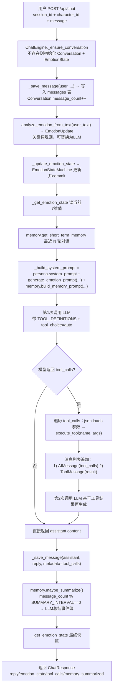

# 项目 2：AI 角色聊天引擎

> 项目源码：[fengnovo/llm-projects](https://github.com/fengnovo/llm-projects)

> 进阶级项目 · FastAPI + 记忆系统 + 情绪状态机 + Function Calling

## 项目简介

一个完整的 AI 虚拟角色对话引擎，实现了：
- **人设系统**：可配置的角色 Prompt，支持多个角色
- **短期记忆**：滑动窗口对话历史
- **长期记忆**：基于"事件簿"的自动总结机制（解决长对话记忆丢失）
- **情绪状态机**：多维情绪 + 好感度系统，影响回复风格
- **Function Calling**：工具调用（解锁图集、查询天气等），支持容错

## 技术栈

**后端**
- FastAPI（Python 异步 Web 框架）
- SQLAlchemy + SQLite（数据库，可替换为 MySQL/PostgreSQL）
- OpenAI SDK（兼容任何 OpenAI 格式的 API）
- Pydantic（数据校验）

**前端**
- 纯 HTML/JS 单文件（无需构建，直接打开即可用）
- 流式 SSE 输出
- 情绪状态可视化

## 项目结构

```
02-ai-character-engine/
├── backend/
│   ├── app/
│   │   ├── main.py              # FastAPI 入口
│   │   ├── config.py            # 配置管理
│   │   ├── database.py          # 数据库连接
│   │   ├── models.py            # 数据模型
│   │   ├── api/
│   │   │   ├── chat.py          # 聊天接口
│   │   │   └── sessions.py      # 会话管理接口
│   │   └── character/
│   │       ├── persona.py       # 角色人设定义
│   │       ├── memory.py        # 记忆系统（短期+长期）
│   │       ├── emotion.py       # 情绪状态机
│   │       ├── tools.py         # Function Calling 工具
│   │       └── engine.py        # 对话引擎核心
│   ├── requirements.txt
│   └── .env.example
└── frontend/
    └── index.html               # 单文件前端 Demo
```

## 快速开始

### 1. 启动后端

```bash
cd 02-ai-character-engine/backend

# 创建虚拟环境（推荐）
python -m venv venv
source venv/bin/activate  # Windows: venv\Scripts\activate

# 安装依赖
pip install -r requirements.txt

# 配置环境变量
cp .env.example .env
# 编辑 .env，填入你的 API Key

# 启动服务
python -m app.main
```

服务会启动在 http://localhost:8000

API 文档：http://localhost:8000/docs

### 2. 打开前端

直接用浏览器打开 `frontend/index.html` 即可。

> 如果你遇到跨域问题，可以用 VS Code 的 Live Server 插件打开，或者用 Python 起一个静态服务：
> ```bash
> cd frontend
> python -m http.server 3000
> ```
> 然后访问 http://localhost:3000

## 核心模块详解

### 1. 人设系统（persona.py）

- 每个角色是一个 `Character` 对象，包含：
  - 基本信息：名字、头像、描述
  - 性格、说话风格、背景故事
  - 完整的 System Prompt
  - 初始情绪值

- 目前内置了两个角色：
  - `senior_sister`：温柔学姐
  - `tsundere`：傲娇青梅竹马

- **如何添加新角色**：在 `CHARACTERS` 字典中添加新的 `Character` 实例即可

### 2. 记忆系统（memory.py）

**短期记忆**：
- 最近 N 轮对话（默认 20 轮）
- 滑动窗口机制，保证 Context 不会超限

**长期记忆（事件簿）**：
- 每 M 轮对话触发一次总结（默认 10 轮）
- 调用 LLM 提取关键信息：
  - 重要事件
  - 用户信息（喜好、性格、经历）
  - 关系变化
  - 约定和承诺
- 总结结果存入 `long_term_memories` 表
- 下次对话时自动注入 Prompt

**为什么重要**：
- 解决长对话中"AI 忘记之前说过的话"的问题
- 解决"车轱辘话"问题（AI 会记得已经聊过什么）
- 让人设更稳定，关系有递进感

### 3. 情绪状态机（emotion.py）

**6 种情绪维度**（0-100）：
- 开心、悲伤、生气、害怕、爱慕、害羞

**好感度系统**（0-100）：
- 陌生人 → 朋友 → 好友 → 暧昧 → 恋人

**工作原理**：
- 每次用户发言后，分析情绪影响
- 更新情绪状态到数据库
- 生成回复时，把当前情绪注入 System Prompt
- AI 根据当前情绪调整回复风格

> 当前用关键词匹配做情绪分析（简化版）
> 生产环境建议用 LLM 来分析，效果更好

### 4. Function Calling（tools.py）

**工具调用流程**：
1. 第一次调用 LLM，传入工具定义
2. 如果模型决定调用工具，执行工具函数
3. 把工具结果加回消息列表
4. 第二次调用 LLM，让它基于工具结果生成自然语言回复

**内置工具**：
- `unlock_gallery`：解锁隐藏图集（模拟付费/打赏功能）
- `get_weather`：查询天气

**扩展思路**：
- 计费相关：查询余额、购买道具
- 内容推荐：推荐音乐、图片、视频
- 系统功能：切换角色、清空记忆

### 5. 对话引擎（engine.py）

整合所有模块的核心类 `ChatEngine`：

```
用户消息
  ↓
保存消息
  ↓
分析情绪 → 更新情绪状态
  ↓
构建 Prompt（人设 + 情绪 + 长期记忆 + 短期记忆）
  ↓
调用 LLM（带 Function Calling）
  ↓
如果有工具调用 → 执行工具 → 二次调用 LLM
  ↓
保存 AI 回复
  ↓
检查是否需要总结长期记忆
  ↓
返回结果
```

---

## 🧱 系统架构

```
          ┌──────────────────────────────────────────────┐
          │               前端 frontend/index.html        │
          │  选角色 · 消息气泡 · 情绪/好感度仪表盘         │
          └────────────────────┬─────────────────────────┘
                               │ JSON / SSE
                               ▼
┌─────────────────────────────────────────────────────────────────┐
│  FastAPI (app/main.py · CORS · lifespan=init_db)                │
│                                                                 │
│  ┌─────────────────┐  ┌─────────────────────────────────────┐   │
│  │ api/chat.py     │  │ api/sessions.py                     │   │
│  │ /chat           │  │ /sessions CRUD · EmotionState查询    │   │
│  │ /chat/stream    │  └──────────────┬──────────────────────┘   │
│  │ /characters     │                 │                          │
│  └────────┬────────┘                 │                          │
│           │                          │ SQLAlchemy AsyncSession   │
│           ▼                          ▼                          │
│  ┌──────────────────────────────────────────┐                   │
│  │     ChatEngine (character/engine.py)      │                   │
│  └───┬──────┬───────┬────────┬──────────────┘                   │
│      │      │       │        │                                  │
│      ▼      ▼       ▼        ▼                                  │
│  persona   memory  emotion  tools.py                            │
│  (角色)    (双层)  (状态机)  FunctionCalling                    │
└──────┬──────┬───────┬────────┬──────────────────────────────────┘
       │      │       │        │
       ▼      ▼       ▼        ▼
   characters  messages  emotion_state  long_term_memories
   (静态字典)  (会话消息)  (6维情绪+好感)    (事件簿总结)
       │      │       │        │
       └──────┴───────┴────────┴──────── SQLAlchemy → SQLite
                                              (可替换 MySQL/PG)
                                            │
                                            ▼
                               ┌──────────────────────────┐
                               │  AsyncOpenAI (兼容Chat API)│
                               │  CHAT_MODEL · temperature  │
                               └──────────────────────────┘
```

| 模块 | 文件 | 关键常量/接口 |
|---|---|---|
| REST 入口 | `app/api/chat.py` | `POST /api/chat`、`POST /api/chat/stream`（SSE）、`GET /api/chat/characters`（列出 `senior_sister`、`tsundere`） |
| 对话引擎 | `app/character/engine.py` | `ChatEngine.chat()` 非流式 + 工具调用；`chat_stream()` 流式（SSE `data: chunk\n\n`） |
| 人设 | `app/character/persona.py` | `CHARACTERS` 字典，每个含 `system_prompt`、`initial_emotions` |
| 记忆 | `app/character/memory.py` | `MemorySystem`：滑动窗口(`SHORT_TERM_MEMORY_WINDOW`) + 每 N 轮触发总结(`LONG_TERM_SUMMARY_INTERVAL`) |
| 情绪 | `app/character/emotion.py` | `EmotionStateMachine.update(delta)`：`happiness/sadness/anger/fear/love/shyness/affection` 0-100 剪裁 |
| 工具 | `app/character/tools.py` | `TOOL_DEFINITIONS`（JSON Schema）+ `execute_tool(name, args)`，当前实现 `unlock_gallery`、`get_weather` |
| 持久化 | `app/models.py` | 4 张表：`conversations(session_id, character_id, message_count)`、`messages(role, content, metadata_)`、`emotion_state`（7 维）、`long_term_memories` |

---

## 🔄 核心流程：一次非流式对话 + Function Calling



**流程证据（代码锚点）：**
- 入口在 [engine.py:171-217](https://github.com/fengnovo/llm-projects/blob/main/02-ai-character-engine/backend/app/character/engine.py#L171-L217)，顺序为 `_ensure_conversation → save_message → analyze_emotion → update_emotion_state → build_system_prompt → _call_llm_with_tools → save_message → maybe_summarize`。
- 两次调用 LLM + 工具注入的子流程在 [engine.py:266-327](https://github.com/fengnovo/llm-projects/blob/main/02-ai-character-engine/backend/app/character/engine.py#L266-L327)，符合 README 里的"1. 首调用 2. 执行工具 3. 二次调用"三段式描述。
- 流式变体 [engine.py:219-264](https://github.com/fengnovo/llm-projects/blob/main/02-ai-character-engine/backend/app/character/engine.py#L219-L264) 简化了工具调用，纯 SSE 推送 `chunk.choices[0].delta.content`，在 [chat.py:52-76](https://github.com/fengnovo/llm-projects/blob/main/02-ai-character-engine/backend/app/api/chat.py#L52-L76) 包装成 `text/event-stream` + `data: ...\n\ndata: [DONE]\n\n`。

---

### 1. 为什么用 FastAPI？
- 异步性能好，适合 I/O 密集的 AI 服务
- 自动生成 API 文档（Swagger UI）
- Pydantic 数据校验，类型安全
- 生态成熟，是目前 AI 服务的事实标准

### 2. 记忆系统的设计思路
- 不是所有东西都要塞进 Context
- 重要信息通过总结"沉淀"到长期记忆
- 短期记忆保证对话的连贯性
- 生产环境还可以加向量检索，从长期记忆中只召回相关的

### 3. 情绪系统的价值
- 让角色更有"灵魂"，不是冷冰冰的问答机器
- 好感度系统给用户成长感和目标感
- 情绪一致性是人设稳定性的重要组成部分

## 可以扩展的方向

1. **多模态**：加入图片/语音消息支持
2. **语音合成**：用 TTS 让角色"说话"
3. **图像生成**：调用 Stable Diffusion 生成角色表情
4. **实时语音**：WebSocket + 语音识别 + TTS
5. **多用户系统**：用户注册登录、好友系统
6. **角色广场**：用户可以创建和分享自己的角色
7. **微调模型**：用聊天数据微调 LoRA，优化角色表现
8. **vLLM 部署**：把模型换成自己部署的开源模型

- ✅ AI 角色引擎与 Agent 开发（核心！）
- ✅ Prompt 工程
- ✅ 多轮长短期记忆机制
- ✅ 情绪与好感度状态机
- ✅ Function Calling 工具封装
- ✅ FastAPI 后端接口
- ✅ Redis / MySQL 基础（数据库部分可以替换）

## 说明
> "独立设计并实现了一个 AI 虚拟角色对话引擎，核心解决三个问题：
> 1. **长对话记忆问题**：用短期滑动窗口 + 长期事件簿总结的双层记忆架构，解决了长对话中记忆丢失和人设崩坏的问题
> 2. **人设稳定性**：通过精细的 System Prompt 设计 + 情绪状态机注入，保证角色性格和说话风格的一致性
> 3. **业务能力封装**：用 Function Calling 将解锁图集、查询等业务能力封装为工具，实现对话与业务的无缝衔接
>
> 技术栈是 FastAPI + SQLAlchemy + OpenAI 兼容接口，前端做了一个 Demo 可以演示。"
