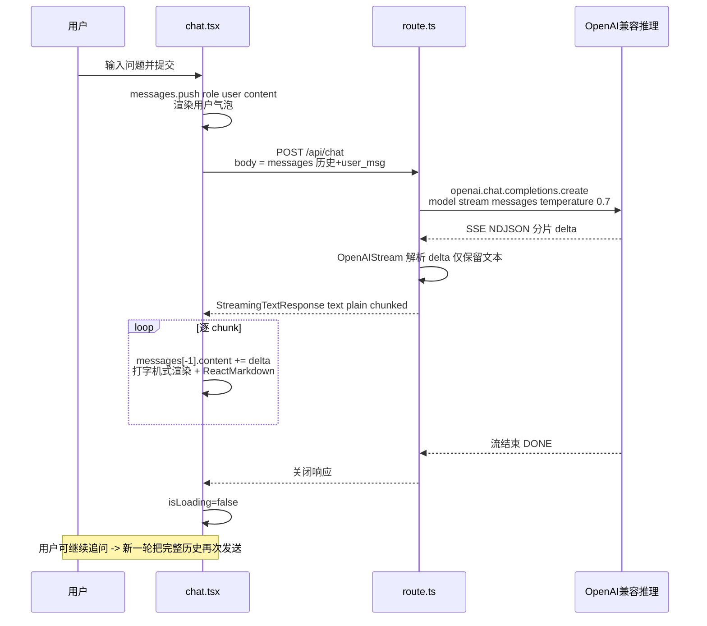

# 项目 1：AI 聊天助手

> 项目源码：[fengnovo/llm-projects](https://github.com/fengnovo/llm-projects)

> 入门级项目 · Next.js + Vercel AI SDK · 前端友好

## 项目简介

一个简洁的 AI 聊天应用，支持流式输出、多轮对话、Markdown 渲染。使用你熟悉的 TypeScript / React 技术栈，快速建立 AI 应用开发的信心。

## 技术栈

- **前端**: Next.js 14 (App Router) + React + TypeScript
- **样式**: Tailwind CSS
- **AI SDK**: Vercel AI SDK（处理流式响应）
- **模型接口**: OpenAI 兼容格式（支持 OpenAI / vLLM / one-api 等）

## 核心功能

- ✅ 流式对话输出（打字机效果）
- ✅ 多轮对话上下文
- ✅ Markdown / 代码高亮渲染
- ✅ 清空对话
- ✅ 加载状态动画
- ✅ 响应式设计

## 快速开始

### 1. 安装依赖

```bash
cd 01-ai-chat-assistant
npm install
```

### 2. 配置环境变量

```bash
cp .env.example .env.local
```

编辑 `.env.local`，填入你的 API Key：

```env
OPENAI_API_KEY=你的api-key
OPENAI_BASE_URL=https://api.openai.com/v1
OPENAI_MODEL=gpt-3.5-turbo
```

> 💡 **也可以用本地部署的模型**：如果你已经用 vLLM 部署了开源模型，修改 `OPENAI_BASE_URL` 为你的 vLLM 地址即可。

### 3. 启动开发服务器

```bash
npm run dev
```

访问 http://localhost:3000 即可使用。

### 1. 流式输出原理
- 使用 `OpenAIStream` 将 SSE 流转换为可读流
- 前端通过 `useChat` hook 自动处理流式消息追加

### 2. 消息格式
- 标准的 OpenAI Chat Completions 格式：`{ role: 'user' | 'assistant' | 'system', content: string }`
- 每次请求都要带上完整的对话历史（这就是 Context）

### 3. Edge Runtime
- API 路由使用 `export const runtime = "edge"`，降低流式响应的延迟

## 可以扩展的方向

1. **多会话管理**：左侧加一个会话列表，用 localStorage 或后端存储
2. **系统提示词配置**：加一个设置面板，可以自定义 System Prompt
3. **模型切换**：支持切换不同的模型（GPT-3.5 / GPT-4 / 本地模型）
4. **消息复制 / 重生成**：单条消息的操作
5. **导出对话**：导出为 Markdown 或 JSON 文件

---

## 🧱 系统架构

```
┌─────────────────────────────────────────────────────────────────┐
│                        浏览器 / 用户端                             │
│  ┌──────────────────────────────────────────────────────────┐   │
│  │  Next.js App Router → components/chat.tsx                │   │
│  │  · useChat() hook (Vercel AI SDK React 端)                │   │
│  │  · 输入框/消息列表/清空/Markdown 渲染                       │   │
│  │  · messages 状态本地维护，每次 submit 全量发送              │   │
│  └──────────────────────────┬───────────────────────────────┘   │
└─────────────────────────────┼───────────────────────────────────┘
                              │ POST /api/chat (multipart/form JSON)
                              ▼
┌─────────────────────────────────────────────────────────────────┐
│                    Next.js Edge Runtime                          │
│  ┌──────────────────────────────────────────────────────────┐   │
│  │  app/api/chat/route.ts                                    │   │
│  │  · export const runtime = "edge"                          │   │
│  │  · 1. JSON 解析 { messages }                              │   │
│  │  · 2. openai.chat.completions.create(stream=True)         │   │
│  │  · 3. OpenAIStream() 包装 SSE → StreamingTextResponse     │   │
│  └──────────────────────────┬───────────────────────────────┘   │
└─────────────────────────────┼───────────────────────────────────┘
                              │ stream=true / server-sent events
                              ▼
            ┌─────────────────────────────────────┐
            │  OpenAI 兼容推理端点 (可替换)        │
            │  OPENAI_BASE_URL + OPENAI_MODEL     │
            │  (OpenAI / vLLM / one-api / DashScope)│
            └─────────────────────────────────────┘
```

| 模块 | 文件 | 职责 |
|---|---|---|
| 前端 Chat 组件 | `components/chat.tsx` | 基于 `useChat` 管理消息状态、提交、流式渲染、清空（第 9 行） |
| 路由 Handler | `app/api/chat/route.ts` | Edge 运行时接收 JSON，透传到流式 Chat Completions（第 5-8 行客户端创建、第 17-27 行响应转换） |
| 配置注入 | `.env.local` / `.env.example` | `OPENAI_API_KEY`、`OPENAI_BASE_URL`、`OPENAI_MODEL` |

---

## 🔄 核心流程：一次流式对话



**关键细节（来自代码）：**
- 每次请求**都会携带完整对话历史**（Context 管理完全由前端负责；后端无状态、Edge Runtime 冷启动延迟更低）——见 `route.ts` 第 14 行 `const { messages } = await req.json()`。
- 流转换用两层封装：先 `response` 传进 `OpenAIStream`（标准 OpenAI 格式→统一可读流），再外层 `new StreamingTextResponse(stream)` 给前端（`route.ts` 第 25-27 行）。
- 清空对话只清空 `useChat` 内部状态（第 22-24 行 `setMessages([])`），不调用后端。

---

- ✅ LLM 应用开发基础
- ✅ Prompt 工程（可以通过扩展 System Prompt 来练习）
- ✅ Context 窗口理解
- ✅ Temperature 等参数调优
