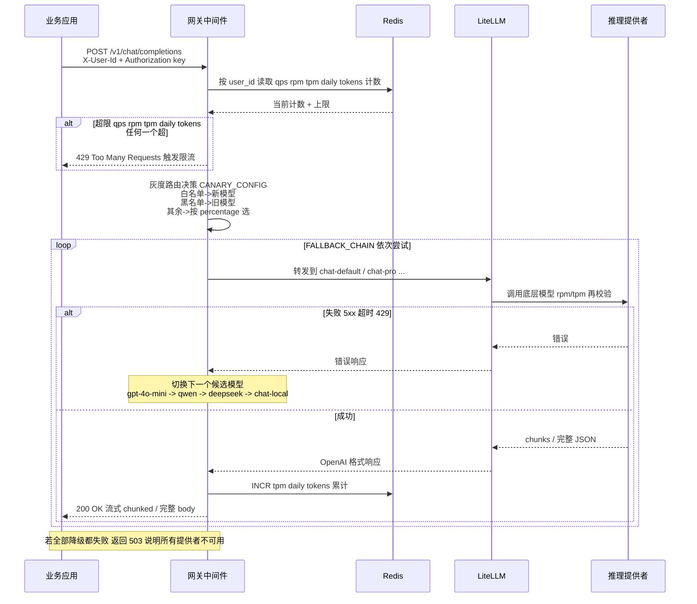

# 项目 6：私有化模型部署 + 模型网关

> 项目源码：[fengnovo/llm-projects](https://github.com/fengnovo/llm-projects)

一个完整的 **LLM 模型网关与私有化部署**实战项目，覆盖从模型部署、网关抽象、限流降级到成本控制的全链路。

## 🎯 目标
- ✅ 开源大模型私有化部署（vLLM / Ollama）
- ✅ 模型网关架构设计（LiteLLM）
- ✅ 多模型统一接入与路由
- ✅ 限流、降级、灰度发布机制
- ✅ Token 成本控制与用量统计
- ✅ 推理优化原理（KV Cache、量化、批处理）

## 🏗️ 项目架构

```
┌─────────────────────────────────────────────────────────┐
│                    业务应用层                             │
│  角色引擎 / RAG / Agent / 各种 LLM 应用                   │
└────────────────────────────┬────────────────────────────┘
                             │
┌────────────────────────────▼────────────────────────────┐
│              网关中间件 (Middleware)                      │
│  限流 / 降级 / 灰度 / 用量统计 / 成本控制                  │
│              (FastAPI + Redis)                           │
└────────────────────────────┬────────────────────────────┘
                             │
┌────────────────────────────▼────────────────────────────┐
│              模型网关 (LiteLLM Proxy)                    │
│      模型抽象层 / 统一 API / 路由分发                     │
└─────────┬──────────┬──────────┬──────────┬──────────────┘
          │          │          │          │
    ┌─────▼──┐ ┌────▼────┐ ┌──▼─────┐ ┌──▼──────────┐
    │ OpenAI │ │ DeepSeek│ │ 通义千问│ │  私有化部署  │
    │ GPT-4o │ │  DeepSeek│ │ Qwen   │ │ vLLM/Ollama │
    └────────┘ └─────────┘ └────────┘ └──────────────┘
```

---

## 🧱 分层架构详细拆解

```
                                  上游 LLM 费用/模型监控
                                         │
┌────────────────────────────────────────┼──────────────────────────────────────┐
│ L4 业务应用层                           │  client_example.py / stress_test.py  │
│  项目01~05 / 任何支持 OpenAI API 的 App │  cost_calculator.py                 │
└─────────────────────┬──────────────────┴──────────────────────────────────────┘
                      │ 调用 Chat Completions / Embeddings（统一 OpenAI 协议）
                      ▼
┌───────────────────────────────────────────────────────────────────────────────┐
│ L3 网关中间件 (middleware/gateway_middleware.py · FastAPI + Redis)             │
│  RATE_LIMITS: default/premium → qps/rpm/tpm/daily_tokens (多级限流 滑动窗口)  │
│  FALLBACK_CHAIN: chat-default → [gpt-4o-mini → qwen-turbo → deepseek → local] │
│  CANARY_CONFIG: chat-default → new=gpt-4o, %=20, 白/黑名单 用户              │
│  入口：httpx → FORWARD → GATEWAY_URL, Redis 不可用时降级为只透传              │
└─────────────────────────────┬─────────────────────────────────────────────────┘
                              │ chat/completions, embeddings...
                              ▼
┌───────────────────────────────────────────────────────────────────────────────┐
│ L2 模型网关 LiteLLM Proxy (gateway/litellm_config.yaml + docker-compose.yml)  │
│  model_list: 云端 gpt-4o-mini/gpt-4o/deepseek-chat/qwen-turbo                │
│              私有化 qwen2.5-7b-local / llama3.2-3b-ollama                     │
│              路由别名 chat-default/chat-pro/chat-lite/chat-local              │
│  内建: 降级回退策略 / rpm & tpm 限速 / 密钥管理 / 后台 UI / Prometheus 指标    │
│  管理后台:  :4000/ui   API 文档: :4000/docs                                   │
└───────┬───────────┬───────────────┬──────────────┬─────────────────────────────┘
        ▼           ▼               ▼              ▼
┌──────────────┐ ┌──────────┐ ┌─────────────┐ ┌────────────────────────────────┐
│ L1 云端 API   │ │ DeepSeek │ │  DashScope  │ │ L1 私有化部署                   │
│  GPT-4o/mini  │ │  通义     │ │  阿里云     │ │ deployment/                    │
│  OpenAI 协议  │ │          │ │ 兼容模式     │ │  · vLLM/deploy_vllm.sh         │
│  sk-xxx       │ │          │ │              │ │    (8000/v1 · 连续批处理)      │
└──────────────┘ └──────────┘ └─────────────┘ │  · Ollama/deploy_ollama.sh      │
        ▲                                       │ │    (11434 · CPU/Mac 可用)     │
        │ 开发演示用:                           │ │  · mock_server/mock_openai.py │
        │ deployment/mock_server/:8000          │ │    (无 GPU 时 Mock "流式"响应)│
        └───────────────────────────────────────┘ └────────────────────────────────┘
                                    ▲
                                    │ 监控面板: monitoring/frontend/index.html
                                    │  读取 LiteLLM UI 指标 / middleware 统计
```

| 层级 | 关键文件 | 职责 & 代码锚点 |
|---|---|---|
| L4 业务客户端 | `examples/client_example.py` / 01~05 项目 | 通过 `base_url = "http://middleware:5000"` 或 `"http://litellm:4000"` 调用；只认 model 别名，不知道底层模型 |
| L3 中间件 | `middleware/gateway_middleware.py:41-72` | `RATE_LIMITS`（第 41-54 行）/ `FALLBACK_CHAIN`（第 57-61 行）/ `CANARY_CONFIG`（第 64-71 行）；`lifespan` 里初始化 `redis.from_url()`，连不上降级（第 81-90 行） |
| L2 LiteLLM Proxy | `gateway/litellm_config.yaml:4-112` | 每个 entry 声明 `model_name` + `litellm_params`；提供 `chat-default` 等别名屏蔽底层差异；配置 `rpm/tpm` 防止打爆上游 |
| L1 云端推理 | `.env` 注入 API Key | `os.environ/OPENAI_API_KEY` / `DEEPSEEK_API_KEY` / `DASHSCOPE_API_KEY` — LiteLLM 用字符串引用自动读取 |
| L1 私有化部署 | `deployment/{vllm,ollama,mock_server}/` | vLLM 提供 `http://localhost:8000/v1`（OpenAI 格式），Ollama 提供 `http://localhost:11434`，Mock 用 FastAPI 伪造增量流 |

---

## 🔄 核心流程：请求过网关 → 限流 → 灰度 → 降级 → 返回



**关键配置&行为证据：**
- 中间件配置中心 `RATE_LIMITS["default"] = {qps:10, rpm:300, tpm:100_000, daily_tokens:1_000_000}`，`premium` 账号 ×5（[middleware.py:41-54](https://github.com/fengnovo/llm-projects/blob/main/06-model-gateway-deployment/middleware/gateway_middleware.py#L41-L54)）。
- 降级链 `FALLBACK_CHAIN["chat-default"] = ["gpt-4o-mini", "qwen-turbo", "deepseek-chat", "chat-local"]`，即云端挂了自动切本地私有化模型（[第 58 行](https://github.com/fengnovo/llm-projects/blob/main/06-model-gateway-deployment/middleware/gateway_middleware.py#L58)）。
- LiteLLM 的模型别名 `chat-default` 与底层模型解耦：只改 `litellm_config.yaml` 就能替换实现，业务代码**一行不改**（[gateway/litellm_config.yaml:56-60](https://github.com/fengnovo/llm-projects/blob/main/06-model-gateway-deployment/gateway/litellm_config.yaml#L56-L60)）。

---

## 📁 项目结构

```
06-model-gateway-deployment/
├── gateway/                    # 模型网关配置
│   ├── litellm_config.yaml    # LiteLLM 网关配置
│   └── docker-compose.yml     # Docker 一键启动
├── deployment/                 # 模型部署
│   ├── vllm/                  # vLLM 部署脚本 + 文档
│   ├── ollama/                # Ollama 部署脚本 + 文档
│   └── mock_server/           # Mock LLM 服务（无 GPU 演示用）
├── middleware/                 # 网关中间件
│   ├── gateway_middleware.py  # 限流/降级/灰度中间件
│   └── requirements.txt
├── monitoring/                 # 监控面板
│   └── frontend/              # 可视化监控面板
├── examples/                   # 示例代码
│   ├── client_example.py      # 网关调用示例
│   ├── stress_test.py         # 压测脚本
│   └── cost_calculator.py     # 成本计算器
├── scripts/                    # 启动脚本
│   ├── start_gateway.sh
│   ├── start_gateway_docker.sh
│   └── start_middleware.sh
├── docs/                       # 文档
│   └── architecture.md        # 架构设计文档
├── .env.example               # 环境变量示例
└── README.md
```

## 🚀 快速开始

### 方式一：Docker 一键启动（推荐，最简单）

```bash
cd 06-model-gateway-deployment

# 复制环境变量
cp .env.example .env
# 编辑 .env 填入你的 API Key（可选）

# 一键启动网关 + Redis + Mock LLM
cd gateway
docker compose up -d
```

启动后访问：
- 网关地址: http://localhost:4000
- 管理后台: http://localhost:4000/ui （key: `sk-admin-gateway-key-change-me`）
- API 文档: http://localhost:4000/docs
- Mock LLM: http://localhost:8000

### 方式二：手动启动

```bash
# 1. 启动 Mock LLM（无 GPU 时）
cd deployment/mock_server
pip install fastapi uvicorn pydantic
python mock_openai.py

# 2. 启动 LiteLLM 网关
cd ../../gateway
pip install 'litellm[proxy]'
litellm --config litellm_config.yaml --port 4000

# 3. 启动中间件（可选，需要 Redis）
cd ../middleware
pip install -r requirements.txt
python gateway_middleware.py

# 4. 打开监控面板
# 用浏览器打开 monitoring/frontend/index.html
```

### 方式三：有 GPU 环境

```bash
# 部署 vLLM（需要 NVIDIA GPU）
cd deployment/vllm
chmod +x deploy_vllm.sh
./deploy_vllm.sh Qwen/Qwen2.5-7B-Instruct 1 8000

# 或者部署 Ollama（支持 CPU / Apple Silicon）
cd ../ollama
chmod +x deploy_ollama.sh
./deploy_ollama.sh qwen2.5:7b
```

## 📝 运行示例

### 1. 基础调用示例

```bash
cd examples
pip install openai python-dotenv
python client_example.py
```

### 2. 压力测试

```bash
# 测试网关直连
python stress_test.py gateway

# 测试中间件（限流）
python stress_test.py middleware

# 测试限流效果
python stress_test.py ratelimit
```

### 3. 成本计算

```bash
python cost_calculator.py
```

## 🔑 核心概念

### 模型网关是什么？

模型网关是业务层和底层模型之间的**抽象层**，类似 API 网关但专门针对 LLM：

```
业务代码 → 模型网关 → 各种模型供应商
```

**为什么需要模型网关？**
1. **统一接口**：所有模型都用 OpenAI 格式调用，换模型不用改代码
2. **成本管控**：统一管理 Key、预算、用量统计
3. **容灾降级**：一个模型挂了自动切到另一个
4. **安全合规**：敏感数据走私有模型，普通请求走云端
5. **灰度发布**：新模型上线可以按比例切流量

### 私有化部署 vs 云端 API

| 维度 | 云端 API | 私有化部署 |
|------|----------|------------|
| 成本 | 按 Token 计费，用多少付多少 | 固定 GPU 成本，用量大更划算 |
| 上线速度 | 几分钟接入 | 需要部署、调优 |
| 数据安全 | 数据出域，有合规风险 | 数据不出内网，安全可控 |
| 定制化 | 只能用现成模型 | 可以微调、加 LoRA |
| 运维成本 | 几乎为零 | 需要 GPU 运维经验 |

**怎么选？**
- 初创期 / 用量小 → 云端 API
- 成熟期 / 用量大 / 数据敏感 → 私有化部署
- 混合模式 → 网关统一管理，按场景路由

### 第一阶段：理解网关
1. 用 Docker 启动 Mock LLM + LiteLLM 网关
2. 跑通 `client_example.py`，体会"统一接口"
3. 修改 `litellm_config.yaml` 添加新模型，观察业务代码无需改动

### 第二阶段：私有化部署
1. 用 Ollama 在本地跑一个小模型（Mac 也能跑）
2. 接入网关，体验"模型从云端切到本地"
3. （可选）租云 GPU 跑 vLLM，对比性能差异

### 第三阶段：中间件深入
1. 启动 Redis + 中间件服务
2. 用压测脚本验证限流功能
3. 模拟模型故障，验证降级机制
4. 调整灰度比例，观察流量分布

### 第四阶段：成本优化
1. 用成本计算器对比不同方案
2. KV Cache、量化、批处理等优化技术
3. 设计自己的成本控制策略

## 📚 延伸阅读

- [LiteLLM 官方文档](https://docs.litellm.ai/)
- [vLLM 官方文档](https://docs.vllm.ai/)
- [Ollama 官网](https://ollama.ai/)
- [One API](https://github.com/songquanpeng/one-api) - 另一个流行的模型网关
- [PagedAttention 论文](https://arxiv.org/abs/2309.06180) - vLLM 核心技术

## ⚠️ 注意事项

1. **没有 GPU 也能学**：Mock LLM + Ollama CPU 模式完全可以演示网关功能
2. **先跑通再深入**：先把链路跑通，再一个个模块深入研究
3. **成本意识**：用云端 API 做测试时注意用量，设置预算提醒
4. **生产环境**：本项目是 Demo，生产环境需要考虑更多安全、监控、容灾措施

## 🤝 与其他项目的联动

- **项目 2（角色引擎）**：把角色引擎的模型调用从直接调 OpenAI 改成调用本项目的网关
- **项目 3（RAG 知识库）**：Embedding 模型也可以通过网关统一管理
- **项目 5（多模态推荐）**：图像模型（CLIP）同样可以接入网关

---
