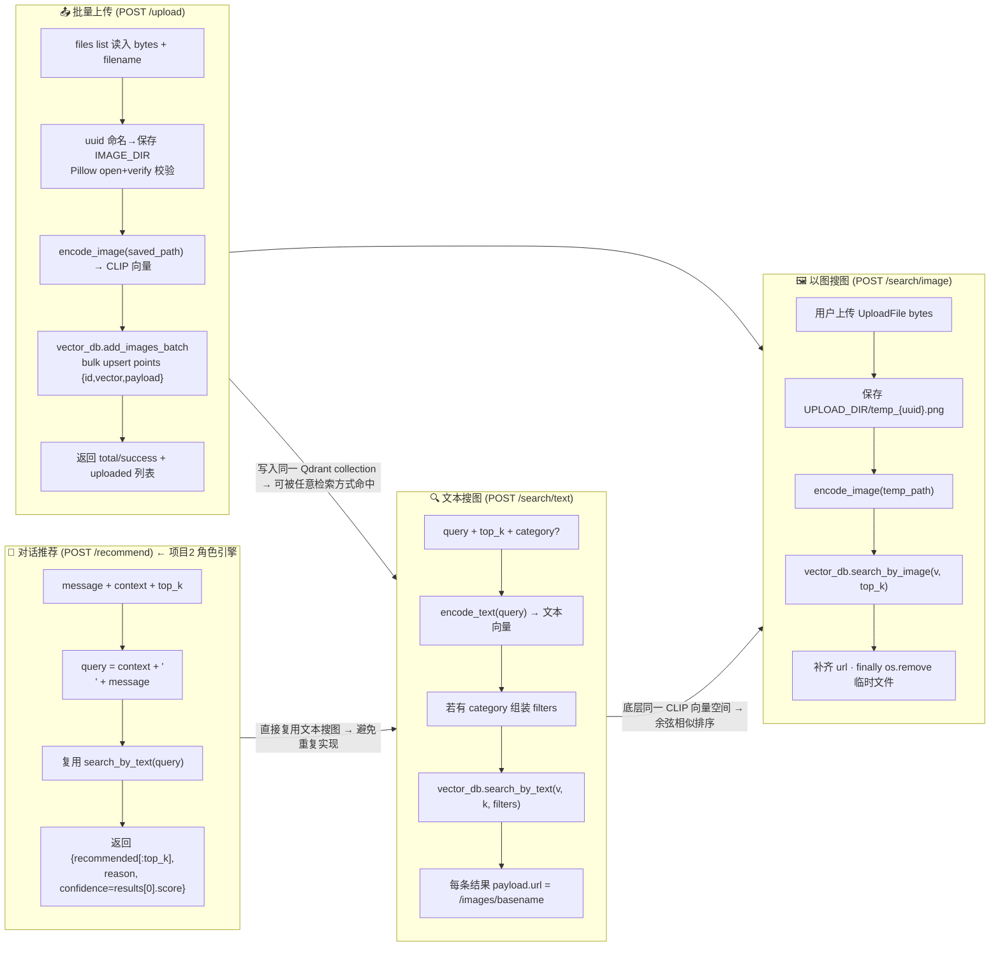

# 项目 5：多模态内容推荐系统

> 项目源码：[fengnovo/llm-projects](https://github.com/fengnovo/llm-projects)

> 高级项目 · CLIP + Qdrant · 图文统一向量空间 · 混合检索

## 项目简介

一个基于 CLIP 多模态模型的图文检索与内容推荐系统。文本和图片被映射到同一个向量空间，实现：
- **文本搜图**：用文字描述找相关图片
- **以图搜图**：用图片找相似图片
- **混合检索**：文本 + 图像加权融合
- **对话推荐**：结合对话语境推荐相关媒体资源

对应 JD 中的「私域内容多模态 RAG 系统」。

## 技术栈

- **CLIP**（sentence-transformers 封装）：多模态 Embedding，图文统一向量空间
- **Qdrant**：高性能向量数据库（本地模式，零依赖部署）
- **FastAPI**：Web 服务
- **Pillow / OpenCV**：图像处理

## 核心功能

- ✅ 图片批量上传 + 自动向量化
- ✅ 文本搜图（Text-to-Image Search）
- ✅ 以图搜图（Image-to-Image Search）
- ✅ 混合检索（RRF 融合算法）
- ✅ 对话内容推荐接口
- ✅ 相似度可视化
- ✅ 内容库管理

## 快速开始

### 1. 安装依赖

```bash
cd 05-multimodal-rag/backend

python -m venv venv
source venv/bin/activate
pip install -r requirements.txt
```

> 注意：首次运行会自动下载 CLIP 模型（约 600MB），需要联网。
> 如果没有 GPU，会自动使用 CPU，速度稍慢但可以运行。

### 2. 启动服务

```bash
cp .env.example .env
python -m app.main
```

- 后端：http://localhost:8003
- API 文档：http://localhost:8003/docs
- 前端：直接打开 `frontend/index.html`

### 3. 测试

1. 准备一些图片（任何 jpg/png 都可以）
2. 打开前端，切换到「上传图片」标签
3. 上传几张图片
4. 切换到「文本搜图」，输入描述试试
5. 或者切换到「以图搜图」，上传一张图片找相似的

## 核心原理

### CLIP 是什么？

CLIP（Contrastive Language-Image Pre-training）是 OpenAI 提出的多模态模型：
- 同时训练一个文本编码器和一个图像编码器
- 把文本和图像映射到**同一个向量空间**
- 语义相似的文本和图像，向量距离也近

这意味着你可以：
- 用文本搜索图片
- 用图片搜索文本
- 用图片搜索图片
- 计算任意图文之间的相似度

### 为什么用 CLIP 做多模态 RAG？

传统的图文检索方案：
- 给图片打标签（用 VLM 生成文字描述）
- 然后对标签做文本检索

问题：
- 信息损失大（一张图的信息远多于几句话）
- 标签质量决定检索上限
- 灵活度不够

CLIP 的方案：
- 直接把图像和文本映射到同一空间
- 端到端的语义匹配
- 更灵活、更准确

### 混合检索（RRF 算法）

当你有多种检索方式时（比如文本检索 + 图像检索），怎么融合结果？

**RRF（Reciprocal Rank Fusion，倒数排名融合）**：
- 对每个检索结果，按排名计算分数：`1 / (k + rank)`
- 不同检索方式的分数加权相加
- 最终按融合分数排序

优点：
- 不需要归一化不同检索的分数（不同模型分数范围可能不同）
- 对排名更敏感（第一名比第二名重要得多）
- 实现简单，效果好

## 项目结构

```
05-multimodal-rag/
├── backend/
│   ├── app/
│   │   ├── main.py                  # FastAPI 入口
│   │   ├── config.py                # 配置
│   │   ├── embedder.py              # CLIP 多模态 Embedding
│   │   ├── vector_db.py             # Qdrant 向量数据库
│   │   ├── multimodal_engine.py     # 多模态引擎核心
│   │   └── api/
│   │       └── multimodal.py        # API 接口
│   ├── requirements.txt
│   └── .env.example
└── frontend/
    └── index.html                   # 前端 Demo
```

## 可以扩展的方向

### 1. 视频支持
- 用 ffmpeg 提取关键帧
- 每帧向量化存入向量库
- 检索时返回视频片段 + 时间戳

### 2. 多模态打标
- 用 VLM（如 Qwen-VL）给图片生成文字描述
- 文字描述也向量化，和图像向量互补
- 实现"关键词 + 语义"的混合检索

### 3. Rerank 重排序
- 初筛用向量检索（快）
- 精排用专门的多模态 Rerank 模型（准）
- 平衡速度和精度

### 4. 标签体系
- 人工标签 + 自动标签结合
- 标签过滤 + 向量检索 = 更精准的结果
- 支持分类、风格、主题等多维度标签

### 5. 和角色引擎集成
- 这是最关键的扩展！
- AI 角色聊天时，根据对话内容自动推荐相关图片
- 实现"AI 伴侣在聊天中自然发图"的效果
- 对应 JD 中的「让 AI 在与用户聊天时能结合语境'读懂空气'」


- ✅ 多模态 RAG 系统
- ✅ 向量化（Embedding）
- ✅ 多模态打标（可扩展）
- ✅ 向量数据库（Qdrant）
- ✅ 混合检索 + Rerank（可扩展）
- ✅ 内容推荐
- ✅ 读懂空气（结合语境推荐）

## 说明

> "一个多模态内容推荐系统，用 CLIP 模型把图片和文本映射到同一个向量空间，
> 支持文本搜图、以图搜图和混合检索。
> 向量数据库用的 Qdrant，混合检索用 RRF 算法融合。
> 还做了一个对话推荐接口，可以根据聊天内容自动推荐相关图片，
> 跟之前做的角色引擎结合起来，就能实现 AI 角色在聊天中自然发图的效果。"

## 推荐的模型

| 模型 | 特点 | 适用场景 |
|------|------|---------|
| `OFA-Sys/chinese-clip-vit-base-patch16` | 中文效果好，开源 | 中文场景（推荐） |
| `openai/clip-vit-base-patch32` | 英文效果好 | 英文场景 |
| `openai/clip-vit-large-patch14` | 精度高，速度慢 | 对精度要求高 |

---

## 🧱 系统架构

```
       ┌──────────────────────────────────────────────────────┐
       │                 前端 frontend/index.html              │
       │  Tab: 文本搜图 / 以图搜图 / 上传图片 / 相似度可视化    │
       └───────────────────────────┬──────────────────────────┘
                                   │  multipart / form / JSON
                                   ▼
 ┌─────────────────────────────────────────────────────────────────────┐
 │ FastAPI (main.py · CORS · /images 静态 · 同源可托管 frontend)        │
 │                                                                     │
 │  app/api/multimodal.py                                              │
 │   POST  /upload          → files[] → engine.upload_images_batch     │
 │   POST  /search/text     → {query,top_k?,category?}                │
 │   POST  /search/image    → file:UploadFile + top_k?                │
 │   POST  /recommend       → message + context? + top_k? (角色引擎用) │
 │   GET   /images/{fname}  → FileResponse(IMAGE_DIR) — 图片回显       │
 │   GET   /stats           → collection stats                         │
 │   DEL   /clear           → shutil.rmtree(IMAGE_DIR) + db.clear()    │
 └────────────────────────────┬────────────────────────────────────────┘
                              ▼
                 ┌────────────────────────────────────┐
                 │ MultimodalEngine                    │
                 │ app/multimodal_engine.py:25         │
                 │  upload_image(s) · search_by_text   │
                 │  search_by_image · recommend_for_   │
                 │  chat · get_stats · clear_all       │
                 └──────┬─────────────────┬────────────┘
                        ▼                 ▼
            MultimodalEmbedder      VectorDB (Qdrant)
            app/embedder.py         app/vector_db.py
            · 单例 __new__          · QdrantClient(:memory: / local)
            · 设备 auto=cuda|cpu|mps · collection: images_collection
            · SentenceTransformer(  · search_by_text/image
                CLIP_MODEL_NAME)    · add_images_batch (bulk upsert)
            · encode_text()         · get_stats: indexed_vectors_count
            · encode_image(path)    · clear (delete payload + points)
                 │                       │
                 ▼                       ▼
            图片本地落盘           Qdrant storage / :memory:
            IMAGE_DIR/*.jpg/png    data/qdrant / 进程内
            引用: /images/basename
                 │
                 ▼
            Pillow 校验 → PIL.open + verify()
            失败: os.remove(saved_path) + 抛 ValueError
```

| 模块 | 文件 | 关键锚点 |
|---|---|---|
| 接口层 | `app/api/multimodal.py` | 6 个 REST 路径（第 25-129 行）；`/upload` 读取 bytes 元组批量送入 `engine.upload_images_batch`（第 36-40 行）；`/recommend` 给角色引擎对接（第 82-98 行） |
| 引擎 | `app/multimodal_engine.py` | 上传走 Pillow 校验失败→删除（第 54-59 行）；`search_by_text/image` 统一把本地路径拼接成 `/images/{basename}` URL（第 137-139 / 164-166 行） |
| 多模态 Embedding | `app/embedder.py` | `encode_text` / `encode_image` 都走 SentenceTransformer（CLIP），并 `normalize_embeddings=True`（第 52-58 行），保证余弦相似度等价于点积排序 |
| 向量库 | `app/vector_db.py` | Qdrant `client.query_points(query=vector, limit=top_k)`（新版 qdrant-client 1.19 风格）；`add_images_batch` 以 uuid 作为 id；`get_stats` 改为 `collection.indexed_vectors_count`（qdrant 1.19 移除了 `vectors_count`） |
| 推荐接口（角色联动） | `engine.py:174-197` | `context + '\n' + user_message` 作为 query → 复用 `search_by_text` → 返回 `{recommended, reason, confidence}` |

---

## 🔄 核心流程：图片入库 + 三种检索



**关键约束（来自代码）：**
- 所有图片首先**本地落盘**再向量化，前端最终通过 `/images/{filename}` 访问绝对回显路径（FileResponse 从 `settings.IMAGE_DIR` 读）。
- 图片入库必须通过 `Pillow` 校验（`img.verify()`），无效图片会回滚删除本地文件并抛 `ValueError: 无效的图片文件`（`engine.py:54-59`）。
- `search_by_image` 使用 `try/finally` 保证 `UPLOAD_DIR/temp_*.png` 一定会清理（`engine.py:156-172`）。
- 向量维度 = `CLIP` 模型输出维度（`embedder.py:49` 的 `vector_size`），`Qdrant.create_collection` 创建时必须对齐该维度（否则 upsert 失败）。

---

## 性能优化建议

1. **GPU 加速**：有 GPU 的话向量化速度快 10~100 倍
2. **批量处理**：批量向量化比单张快很多
3. **索引优化**：数据量大时用 HNSW 索引
4. **缓存**：热门查询结果缓存
5. **量化**：向量量化（FP16、INT8）减少显存/内存占用
