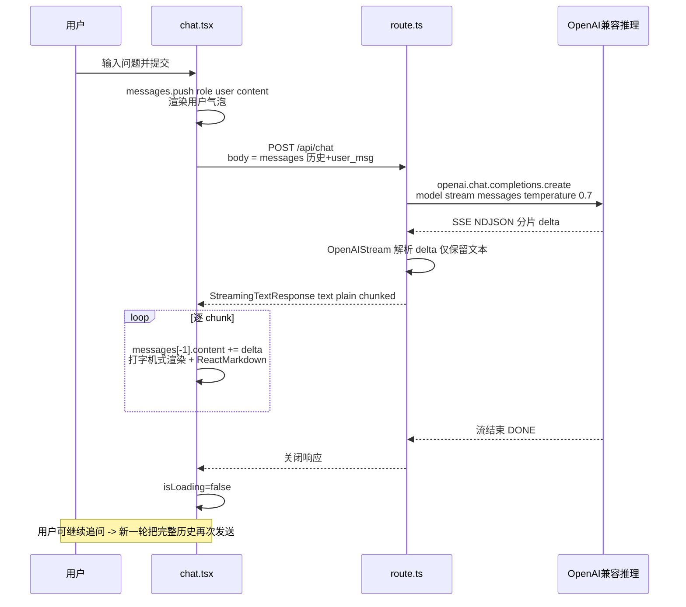
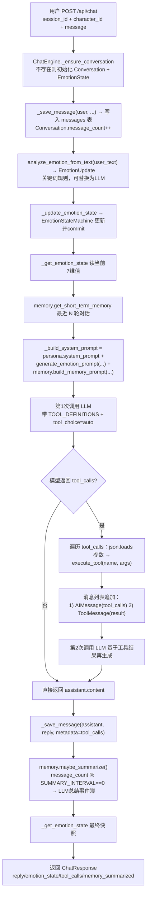
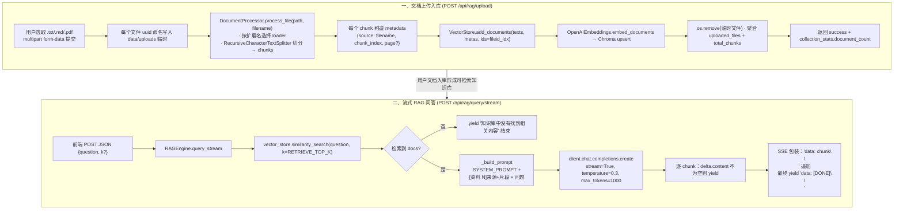
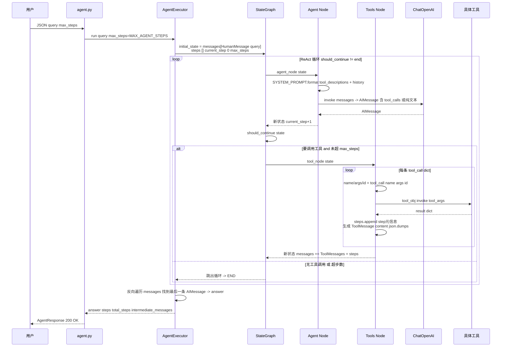
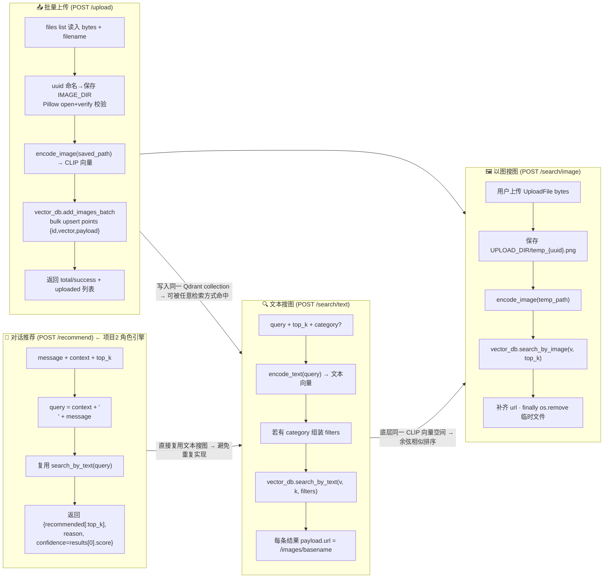
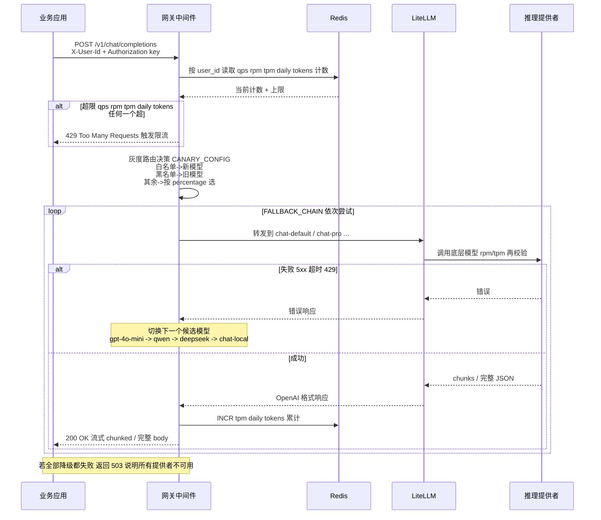

# LLM 应用实战项目合集

> 项目源码：[fengnovo/llm-projects](https://github.com/fengnovo/llm-projects)

1.  __pycache__ 目录 它完全等价于前端的 node_modules/.cache！用于存储 Python 编译后的中间文件
2. venv 目录类似 前端的 node_modules，用于存储 Python 环境依赖
3. python3 -m venv venv 可以创建上面的 venv 目录，用于隔离 Python 环境 
4. 激活 venv 环境：source venv/bin/activate  类似前端的 nvm use 命令，会自动激活环境
5. 安装依赖：pip install -r requirements.txt 类似前端的 npm install 命令，会根据 requirements.txt 安装依赖
6. 运行项目：python app/main.py
7. 访问 http://localhost:8001/ 即可打开界面


__pycache__ 目录下的__init__.cpython-313.pyc 文件是 Python 编译后的字节码文件，用于存储 Python 类的元数据

| 片段 | 含义 | 前端类比 |
| --- | --- | --- |
| __init__ | 对应的源文件名（__init__.py） | 就是源文件的名字 |
| cpython | 解释器类型（标准 Python 就是用 C 写的 CPython） | 类似于“Chromium V8”引擎 |
| 313 | Python 版本号（3.13） | 相当于“Node v20.x” |
| .pyc | 编译后的字节码文件 | 类似于 .cache 或 .map 文件 |

.env 文件里的值优先级高于 config.py 里写的默认值。
```
class Config:
    env_file = ".env.example"   # 改完后，程序会去读 .env.example
```


## 项目清单汇总

> 每个项目的 README 都已补齐「🧱 系统架构」与「🔄 核心流程图」章节（Mermaid 图，GitHub/Typora/VSCode 预览原生支持），点击「架构 / 流程」可直达。

| # | 项目名称 | 技术栈 | 核心能力 | 架构图 | 流程图 |
|---|----------|--------|---------|---|---|
| 1 | [AI 聊天助手](#项目-1-ai-聊天助手) | Next.js + TypeScript + Vercel AI SDK | LLM 调用、流式输出 | [直达](#🧱-系统架构) | [直达](#🔄-核心流程-一次流式对话) |
| 2 | [AI 角色聊天引擎](#项目-2-ai-角色聊天引擎) | FastAPI + SQLAlchemy + SQLite + AsyncOpenAI | 人设、双层记忆、情绪状态机、Function Calling | [直达](#🧱-系统架构-1) | [直达](#🔄-核心流程-一次非流式对话-function-calling) |
| 3 | [RAG 知识库问答](#项目-3-rag-知识库问答系统) | FastAPI + LangChain + ChromaDB + OpenAI Embeddings | 文档切片入库、向量检索、流式 RAG、引用溯源 | [直达](#🧱-系统架构-2) | [直达](#🔄-核心流程-上传文档-流式问答) |
| 4 | [Agent 任务助手](#项目-4-agent-任务助手) | FastAPI + LangGraph + ChatOpenAI.bind_tools | ReAct 推理、5 个内置工具、循环编排、死循环保护 | [直达](#🧱-系统架构-3) | [直达](#🔄-核心流程-langgraph-react-迭代) |
| 5 | [多模态内容推荐](#项目-5-多模态内容推荐系统) | FastAPI + CLIP(SentenceTransformer) + Qdrant | 批量入图、文本搜图、以图搜图、RRF混合、对话推荐 | [直达](#🧱-系统架构-4) | [直达](#🔄-核心流程-图片入库-三种检索) |
| 6 | [模型网关与部署](#项目-6-私有化模型部署-模型网关) | LiteLLM Proxy + vLLM/Ollama + Redis + FastAPI中间件 | 模型别名抽象、多级限流、灰度切流、降级链、成本统计、私有化部署 | [直达](#🧱-分层架构详细拆解) | [直达](#🔄-核心流程-请求过网关-→-限流-→-灰度-→-降级-→-返回) |

---


---

## 项目 1：AI 聊天助手


> 入门级项目 · Next.js + Vercel AI SDK · 前端友好

### 项目简介

一个简洁的 AI 聊天应用，支持流式输出、多轮对话、Markdown 渲染。使用你熟悉的 TypeScript / React 技术栈，快速建立 AI 应用开发的信心。

### 技术栈

- **前端**: Next.js 14 (App Router) + React + TypeScript
- **样式**: Tailwind CSS
- **AI SDK**: Vercel AI SDK（处理流式响应）
- **模型接口**: OpenAI 兼容格式（支持 OpenAI / vLLM / one-api 等）

### 核心功能

- ✅ 流式对话输出（打字机效果）
- ✅ 多轮对话上下文
- ✅ Markdown / 代码高亮渲染
- ✅ 清空对话
- ✅ 加载状态动画
- ✅ 响应式设计

### 快速开始

#### 1. 安装依赖

```bash
cd 01-ai-chat-assistant
npm install
```

#### 2. 配置环境变量

```bash
cp .env.example .env.local
```

编辑 `.env.local`，填入你的 API Key：

```env
OPENAI_API_KEY=你的api-key
OPENAI_BASE_URL=https://api.openai.com/v1
OPENAI_MODEL=gpt-3.5-turbo
```

> 💡 **也可以用本地部署的模型**：如果你已经用 vLLM 部署了开源模型，修改 `OPENAI_BASE_URL` 为你的 vLLM 地址即可。

#### 3. 启动开发服务器

```bash
npm run dev
```

访问 http://localhost:3000 即可使用。

#### 1. 流式输出原理
- 使用 `OpenAIStream` 将 SSE 流转换为可读流
- 前端通过 `useChat` hook 自动处理流式消息追加

#### 2. 消息格式
- 标准的 OpenAI Chat Completions 格式：`{ role: 'user' | 'assistant' | 'system', content: string }`
- 每次请求都要带上完整的对话历史（这就是 Context）

#### 3. Edge Runtime
- API 路由使用 `export const runtime = "edge"`，降低流式响应的延迟

### 可以扩展的方向

1. **多会话管理**：左侧加一个会话列表，用 localStorage 或后端存储
2. **系统提示词配置**：加一个设置面板，可以自定义 System Prompt
3. **模型切换**：支持切换不同的模型（GPT-3.5 / GPT-4 / 本地模型）
4. **消息复制 / 重生成**：单条消息的操作
5. **导出对话**：导出为 Markdown 或 JSON 文件

---

### 🧱 系统架构

```
┌─────────────────────────────────────────────────────────────────┐
│                        浏览器 / 用户端                             │
│  ┌──────────────────────────────────────────────────────────┐   │
│  │  Next.js App Router → components/chat.tsx                │   │
│  │  · useChat() hook (Vercel AI SDK React 端)                │   │
│  │  · 输入框/消息列表/清空/Markdown 渲染                       │   │
│  │  · messages 状态本地维护，每次 submit 全量发送              │   │
│  └──────────────────────────┬───────────────────────────────┘   │
└─────────────────────────────┼───────────────────────────────────┘
                              │ POST /api/chat (multipart/form JSON)
                              ▼
┌─────────────────────────────────────────────────────────────────┐
│                    Next.js Edge Runtime                          │
│  ┌──────────────────────────────────────────────────────────┐   │
│  │  app/api/chat/route.ts                                    │   │
│  │  · export const runtime = "edge"                          │   │
│  │  · 1. JSON 解析 { messages }                              │   │
│  │  · 2. openai.chat.completions.create(stream=True)         │   │
│  │  · 3. OpenAIStream() 包装 SSE → StreamingTextResponse     │   │
│  └──────────────────────────┬───────────────────────────────┘   │
└─────────────────────────────┼───────────────────────────────────┘
                              │ stream=true / server-sent events
                              ▼
            ┌─────────────────────────────────────┐
            │  OpenAI 兼容推理端点 (可替换)        │
            │  OPENAI_BASE_URL + OPENAI_MODEL     │
            │  (OpenAI / vLLM / one-api / DashScope)│
            └─────────────────────────────────────┘
```

| 模块 | 文件 | 职责 |
|---|---|---|
| 前端 Chat 组件 | `components/chat.tsx` | 基于 `useChat` 管理消息状态、提交、流式渲染、清空（第 9 行） |
| 路由 Handler | `app/api/chat/route.ts` | Edge 运行时接收 JSON，透传到流式 Chat Completions（第 5-8 行客户端创建、第 17-27 行响应转换） |
| 配置注入 | `.env.local` / `.env.example` | `OPENAI_API_KEY`、`OPENAI_BASE_URL`、`OPENAI_MODEL` |

---

### 🔄 核心流程：一次流式对话



**关键细节（来自代码）：**
- 每次请求**都会携带完整对话历史**（Context 管理完全由前端负责；后端无状态、Edge Runtime 冷启动延迟更低）——见 `route.ts` 第 14 行 `const { messages } = await req.json()`。
- 流转换用两层封装：先 `response` 传进 `OpenAIStream`（标准 OpenAI 格式→统一可读流），再外层 `new StreamingTextResponse(stream)` 给前端（`route.ts` 第 25-27 行）。
- 清空对话只清空 `useChat` 内部状态（第 22-24 行 `setMessages([])`），不调用后端。

---

- ✅ LLM 应用开发基础
- ✅ Prompt 工程（可以通过扩展 System Prompt 来练习）
- ✅ Context 窗口理解
- ✅ Temperature 等参数调优


---

## 项目 2：AI 角色聊天引擎


> 进阶级项目 · FastAPI + 记忆系统 + 情绪状态机 + Function Calling

### 项目简介

一个完整的 AI 虚拟角色对话引擎，实现了：
- **人设系统**：可配置的角色 Prompt，支持多个角色
- **短期记忆**：滑动窗口对话历史
- **长期记忆**：基于"事件簿"的自动总结机制（解决长对话记忆丢失）
- **情绪状态机**：多维情绪 + 好感度系统，影响回复风格
- **Function Calling**：工具调用（解锁图集、查询天气等），支持容错

### 技术栈

**后端**
- FastAPI（Python 异步 Web 框架）
- SQLAlchemy + SQLite（数据库，可替换为 MySQL/PostgreSQL）
- OpenAI SDK（兼容任何 OpenAI 格式的 API）
- Pydantic（数据校验）

**前端**
- 纯 HTML/JS 单文件（无需构建，直接打开即可用）
- 流式 SSE 输出
- 情绪状态可视化

### 项目结构

```
02-ai-character-engine/
├── backend/
│   ├── app/
│   │   ├── main.py              # FastAPI 入口
│   │   ├── config.py            # 配置管理
│   │   ├── database.py          # 数据库连接
│   │   ├── models.py            # 数据模型
│   │   ├── api/
│   │   │   ├── chat.py          # 聊天接口
│   │   │   └── sessions.py      # 会话管理接口
│   │   └── character/
│   │       ├── persona.py       # 角色人设定义
│   │       ├── memory.py        # 记忆系统（短期+长期）
│   │       ├── emotion.py       # 情绪状态机
│   │       ├── tools.py         # Function Calling 工具
│   │       └── engine.py        # 对话引擎核心
│   ├── requirements.txt
│   └── .env.example
└── frontend/
    └── index.html               # 单文件前端 Demo
```

### 快速开始

#### 1. 启动后端

```bash
cd 02-ai-character-engine/backend

# 创建虚拟环境（推荐）
python -m venv venv
source venv/bin/activate  # Windows: venv\Scripts\activate

# 安装依赖
pip install -r requirements.txt

# 配置环境变量
cp .env.example .env
# 编辑 .env，填入你的 API Key

# 启动服务
python -m app.main
```

服务会启动在 http://localhost:8000

API 文档：http://localhost:8000/docs

#### 2. 打开前端

直接用浏览器打开 `frontend/index.html` 即可。

> 如果你遇到跨域问题，可以用 VS Code 的 Live Server 插件打开，或者用 Python 起一个静态服务：
> ```bash
> cd frontend
> python -m http.server 3000
> ```
> 然后访问 http://localhost:3000

### 核心模块详解

#### 1. 人设系统（persona.py）

- 每个角色是一个 `Character` 对象，包含：
  - 基本信息：名字、头像、描述
  - 性格、说话风格、背景故事
  - 完整的 System Prompt
  - 初始情绪值

- 目前内置了两个角色：
  - `senior_sister`：温柔学姐
  - `tsundere`：傲娇青梅竹马

- **如何添加新角色**：在 `CHARACTERS` 字典中添加新的 `Character` 实例即可

#### 2. 记忆系统（memory.py）

**短期记忆**：
- 最近 N 轮对话（默认 20 轮）
- 滑动窗口机制，保证 Context 不会超限

**长期记忆（事件簿）**：
- 每 M 轮对话触发一次总结（默认 10 轮）
- 调用 LLM 提取关键信息：
  - 重要事件
  - 用户信息（喜好、性格、经历）
  - 关系变化
  - 约定和承诺
- 总结结果存入 `long_term_memories` 表
- 下次对话时自动注入 Prompt

**为什么重要**：
- 解决长对话中"AI 忘记之前说过的话"的问题
- 解决"车轱辘话"问题（AI 会记得已经聊过什么）
- 让人设更稳定，关系有递进感

#### 3. 情绪状态机（emotion.py）

**6 种情绪维度**（0-100）：
- 开心、悲伤、生气、害怕、爱慕、害羞

**好感度系统**（0-100）：
- 陌生人 → 朋友 → 好友 → 暧昧 → 恋人

**工作原理**：
- 每次用户发言后，分析情绪影响
- 更新情绪状态到数据库
- 生成回复时，把当前情绪注入 System Prompt
- AI 根据当前情绪调整回复风格

> 当前用关键词匹配做情绪分析（简化版）
> 生产环境建议用 LLM 来分析，效果更好

#### 4. Function Calling（tools.py）

**工具调用流程**：
1. 第一次调用 LLM，传入工具定义
2. 如果模型决定调用工具，执行工具函数
3. 把工具结果加回消息列表
4. 第二次调用 LLM，让它基于工具结果生成自然语言回复

**内置工具**：
- `unlock_gallery`：解锁隐藏图集（模拟付费/打赏功能）
- `get_weather`：查询天气

**扩展思路**：
- 计费相关：查询余额、购买道具
- 内容推荐：推荐音乐、图片、视频
- 系统功能：切换角色、清空记忆

#### 5. 对话引擎（engine.py）

整合所有模块的核心类 `ChatEngine`：

```
用户消息
  ↓
保存消息
  ↓
分析情绪 → 更新情绪状态
  ↓
构建 Prompt（人设 + 情绪 + 长期记忆 + 短期记忆）
  ↓
调用 LLM（带 Function Calling）
  ↓
如果有工具调用 → 执行工具 → 二次调用 LLM
  ↓
保存 AI 回复
  ↓
检查是否需要总结长期记忆
  ↓
返回结果
```

---

### 🧱 系统架构

```
          ┌──────────────────────────────────────────────┐
          │               前端 frontend/index.html        │
          │  选角色 · 消息气泡 · 情绪/好感度仪表盘         │
          └────────────────────┬─────────────────────────┘
                               │ JSON / SSE
                               ▼
┌─────────────────────────────────────────────────────────────────┐
│  FastAPI (app/main.py · CORS · lifespan=init_db)                │
│                                                                 │
│  ┌─────────────────┐  ┌─────────────────────────────────────┐   │
│  │ api/chat.py     │  │ api/sessions.py                     │   │
│  │ /chat           │  │ /sessions CRUD · EmotionState查询    │   │
│  │ /chat/stream    │  └──────────────┬──────────────────────┘   │
│  │ /characters     │                 │                          │
│  └────────┬────────┘                 │                          │
│           │                          │ SQLAlchemy AsyncSession   │
│           ▼                          ▼                          │
│  ┌──────────────────────────────────────────┐                   │
│  │     ChatEngine (character/engine.py)      │                   │
│  └───┬──────┬───────┬────────┬──────────────┘                   │
│      │      │       │        │                                  │
│      ▼      ▼       ▼        ▼                                  │
│  persona   memory  emotion  tools.py                            │
│  (角色)    (双层)  (状态机)  FunctionCalling                    │
└──────┬──────┬───────┬────────┬──────────────────────────────────┘
       │      │       │        │
       ▼      ▼       ▼        ▼
   characters  messages  emotion_state  long_term_memories
   (静态字典)  (会话消息)  (6维情绪+好感)    (事件簿总结)
       │      │       │        │
       └──────┴───────┴────────┴──────── SQLAlchemy → SQLite
                                              (可替换 MySQL/PG)
                                            │
                                            ▼
                               ┌──────────────────────────┐
                               │  AsyncOpenAI (兼容Chat API)│
                               │  CHAT_MODEL · temperature  │
                               └──────────────────────────┘
```

| 模块 | 文件 | 关键常量/接口 |
|---|---|---|
| REST 入口 | `app/api/chat.py` | `POST /api/chat`、`POST /api/chat/stream`（SSE）、`GET /api/chat/characters`（列出 `senior_sister`、`tsundere`） |
| 对话引擎 | `app/character/engine.py` | `ChatEngine.chat()` 非流式 + 工具调用；`chat_stream()` 流式（SSE `data: chunk\n\n`） |
| 人设 | `app/character/persona.py` | `CHARACTERS` 字典，每个含 `system_prompt`、`initial_emotions` |
| 记忆 | `app/character/memory.py` | `MemorySystem`：滑动窗口(`SHORT_TERM_MEMORY_WINDOW`) + 每 N 轮触发总结(`LONG_TERM_SUMMARY_INTERVAL`) |
| 情绪 | `app/character/emotion.py` | `EmotionStateMachine.update(delta)`：`happiness/sadness/anger/fear/love/shyness/affection` 0-100 剪裁 |
| 工具 | `app/character/tools.py` | `TOOL_DEFINITIONS`（JSON Schema）+ `execute_tool(name, args)`，当前实现 `unlock_gallery`、`get_weather` |
| 持久化 | `app/models.py` | 4 张表：`conversations(session_id, character_id, message_count)`、`messages(role, content, metadata_)`、`emotion_state`（7 维）、`long_term_memories` |

---

### 🔄 核心流程：一次非流式对话 + Function Calling



**流程证据（代码锚点）：**
- 入口在 [engine.py:171-217](https://github.com/fengnovo/llm-projects/blob/main/02-ai-character-engine/backend/app/character/engine.py#L171-L217)，顺序为 `_ensure_conversation → save_message → analyze_emotion → update_emotion_state → build_system_prompt → _call_llm_with_tools → save_message → maybe_summarize`。
- 两次调用 LLM + 工具注入的子流程在 [engine.py:266-327](https://github.com/fengnovo/llm-projects/blob/main/02-ai-character-engine/backend/app/character/engine.py#L266-L327)，符合 README 里的"1. 首调用 2. 执行工具 3. 二次调用"三段式描述。
- 流式变体 [engine.py:219-264](https://github.com/fengnovo/llm-projects/blob/main/02-ai-character-engine/backend/app/character/engine.py#L219-L264) 简化了工具调用，纯 SSE 推送 `chunk.choices[0].delta.content`，在 [chat.py:52-76](https://github.com/fengnovo/llm-projects/blob/main/02-ai-character-engine/backend/app/api/chat.py#L52-L76) 包装成 `text/event-stream` + `data: ...\n\ndata: [DONE]\n\n`。

---

#### 1. 为什么用 FastAPI？
- 异步性能好，适合 I/O 密集的 AI 服务
- 自动生成 API 文档（Swagger UI）
- Pydantic 数据校验，类型安全
- 生态成熟，是目前 AI 服务的事实标准

#### 2. 记忆系统的设计思路
- 不是所有东西都要塞进 Context
- 重要信息通过总结"沉淀"到长期记忆
- 短期记忆保证对话的连贯性
- 生产环境还可以加向量检索，从长期记忆中只召回相关的

#### 3. 情绪系统的价值
- 让角色更有"灵魂"，不是冷冰冰的问答机器
- 好感度系统给用户成长感和目标感
- 情绪一致性是人设稳定性的重要组成部分

### 可以扩展的方向

1. **多模态**：加入图片/语音消息支持
2. **语音合成**：用 TTS 让角色"说话"
3. **图像生成**：调用 Stable Diffusion 生成角色表情
4. **实时语音**：WebSocket + 语音识别 + TTS
5. **多用户系统**：用户注册登录、好友系统
6. **角色广场**：用户可以创建和分享自己的角色
7. **微调模型**：用聊天数据微调 LoRA，优化角色表现
8. **vLLM 部署**：把模型换成自己部署的开源模型

- ✅ AI 角色引擎与 Agent 开发（核心！）
- ✅ Prompt 工程
- ✅ 多轮长短期记忆机制
- ✅ 情绪与好感度状态机
- ✅ Function Calling 工具封装
- ✅ FastAPI 后端接口
- ✅ Redis / MySQL 基础（数据库部分可以替换）

### 说明
> "独立设计并实现了一个 AI 虚拟角色对话引擎，核心解决三个问题：
> 1. **长对话记忆问题**：用短期滑动窗口 + 长期事件簿总结的双层记忆架构，解决了长对话中记忆丢失和人设崩坏的问题
> 2. **人设稳定性**：通过精细的 System Prompt 设计 + 情绪状态机注入，保证角色性格和说话风格的一致性
> 3. **业务能力封装**：用 Function Calling 将解锁图集、查询等业务能力封装为工具，实现对话与业务的无缝衔接
>
> 技术栈是 FastAPI + SQLAlchemy + OpenAI 兼容接口，前端做了一个 Demo 可以演示。"


---

## 项目 3：RAG 知识库问答系统


> 基础项目 · ChromaDB + LangChain + FastAPI

### 项目简介

一个完整的 RAG（检索增强生成）知识库问答系统，支持上传文档、向量化存储、基于文档内容的智能问答。

### 技术栈

**后端**
- FastAPI（Web 框架）
- LangChain（RAG 流程编排）
- ChromaDB（向量数据库，轻量级本地持久化）
- OpenAI Embedding（向量化）
- PyPDF（PDF 解析）

**前端**
- 纯 HTML/JS 单文件
- 支持文件上传、流式问答
- 知识库统计展示

### 核心功能

- ✅ 文档上传（支持 .txt / .md / .pdf）
- ✅ 文档切片（RecursiveCharacterTextSplitter）
- ✅ 向量化存储（ChromaDB 本地持久化）
- ✅ 相似度检索
- ✅ RAG 问答（流式 + 非流式）
- ✅ 引用来源展示
- ✅ 知识库管理（统计、清空）

### 快速开始

#### 1. 启动后端

```bash
cd 03-rag-knowledge-base/backend

# 创建虚拟环境
python -m venv venv
source venv/bin/activate  # Windows: venv\Scripts\activate

# 安装依赖
pip install -r requirements.txt

# 配置环境变量
cp .env.example .env
# 编辑 .env，填入你的 API Key

# 启动服务
python -m app.main
```

服务启动在 http://localhost:8001

API 文档：http://localhost:8001/docs

#### 2. 打开前端

直接用浏览器打开 `frontend/index.html`。

或者用 Python 起静态服务：
```bash
cd frontend
python -m http.server 3001
```

#### 3. 测试

1. 上传 `sample_docs/` 目录下的示例文档（rag-intro.md、langchain-intro.md）
2. 试试问这些问题：
   - "什么是 RAG？"
   - "RAG 的基本流程是什么？"
   - "LangChain 的核心概念有哪些？"
   - "LangChain 和 LangGraph 有什么区别？"

### RAG 原理详解

#### 整体流程

```
用户提问
   ↓
问题向量化（Embedding）
   ↓
向量数据库相似度检索
   ↓
拿到 Top-K 相关文档片段
   ↓
构建 Prompt：System + 参考资料 + 用户问题
   ↓
调用 LLM 生成回答
   ↓
返回回答 + 引用来源
```

#### 文档切片策略

为什么要切片？
- LLM 的 Context 窗口有限
- 检索的粒度要合适：太粗找不到细节，太细丢失上下文

本项目用 `RecursiveCharacterTextSplitter`：
- 按换行符、句号、感叹号等分隔符递归切分
- 保证每个片段有一定的重叠（overlap），避免边界信息丢失
- 默认 500 字符一片段，重叠 50 字符

#### 相似度检索

向量检索的本质：
- 把文本转成高维向量（比如 1536 维）
- 语义相似的文本，向量距离也近
- 用余弦相似度或欧氏距离衡量相似度

ChromaDB 默认用余弦相似度。

#### 为什么 RAG 能减少幻觉？

- 模型回答时"开卷考试"，有参考资料
- Prompt 中明确要求"只根据参考资料回答，不知道就说不知道"
- 可以追溯答案来源，可解释性强

---

### 🧱 系统架构

```
        ┌───────────────────────────────────────────┐
        │          前端 frontend/index.html          │
        │  上传文档 · 知识库统计 · 流式问答 · 清空    │
        │  （默认 FastAPI 同源托管：http://host:8001/ ）│
        └───────────────┬───────────────────────────┘
                        │ fetch /api/rag/*
                        ▼
  ┌─────────────────────────────────────────────────────────────┐
  │ FastAPI (main.py · CORS allow_origins="*" · 同源托管静态页) │
  │                                                             │
  │ api/rag.py                                                  │
  │  POST  /upload        → 文件列表 → 文档处理 → 入库           │
  │  POST  /add-text      → 直接切片入库                         │
  │  POST  /query         → RAGEngine.query()                  │
  │  POST  /query/stream  → SSE (data: chunk\n\n)              │
  │  GET   /stats         → Chroma collection 统计               │
  │  DEL   /clear         → delete_collection                   │
  └──┬────────────────┬─────────────────────────┬───────────────┘
     ▼                ▼                         ▼
DocumentProcessor   RAGEngine              VectorStore
(文档处理模块)    (问答编排引擎)          (ChromaDB封装)
                   - SYSTEM_PROMPT            - get_vector_store()
                   - _build_context           - similarity_search
                   - _build_prompt            - add_documents
                   - query / query_stream     - get_collection_stats
                   - add_document              - delete_collection
     │                │                         │
     ▼                ▼                         ▼
  PyPDF +          AsyncOpenAI            Chroma PersistentClient
  langchain        (CHAT_MODEL ·           (embedding_function=
  TextSplitter     temperature=0.3)         OpenAIEmbeddings ·
  (chunk=500,                               check_embedding_ctx_length=False ·
   overlap=50)                             chunk_size=10 ·
     │                                     cosine相似度)
     ▼                                        │
 [资料 i] 来源：xxx（片段 N）                  ▼
  +  chunk元数据                     Chroma SQLite + parquet 持久化
     │                               路径：data/chroma/
     ▼
  UPLOAD_DIR 临时文件（处理完即 os.remove）
```

| 模块 | 文件 | 关键实现 |
|---|---|---|
| REST 接口 | `app/api/rag.py` | 上传走 `DocumentProcessor.process_file` + `vector_store.add_documents`（第 65-118 行）；流式走 `engine.query_stream` + `StreamingResponse`（第 42-62 行） |
| 文档处理器 | `app/document_processor.py` | `load_file` 按后缀分发（`.pdf`→PyPDF；`.txt/.md`→utf8 文本）；`RecursiveCharacterTextSplitter(chunk_size=CHUNK_SIZE, overlap=CHUNK_OVERLAP, 中文分隔符)` |
| RAG 引擎 | `app/rag_engine.py` | `SYSTEM_PROMPT` 明确禁止编造（第 24-37 行）；`_build_context` 标注"[资料 N] 来源+片段编号"（第 46-55 行）；`sources` 去重返回（第 114-120 行） |
| 向量库 | `app/vectorstore.py` | `Chroma(persist_directory, embedding_function=OpenAIEmbeddings(base_url, model, check_embedding_ctx_length=False))` |
| 配置 | `app/config.py` / `.env` | `CHUNK_SIZE / CHUNK_OVERLAP / RETRIEVE_TOP_K / EMBEDDING_MODEL / CHAT_MODEL` |

---

### 🔄 核心流程：上传文档 + 流式问答



**代码锚点与关键约定：**
- 上传接口入口 [rag.py:65-118](https://github.com/fengnovo/llm-projects/blob/main/03-rag-knowledge-base/backend/app/api/rag.py#L65-L118)：`file_id = uuid4()` + `os.remove(file_path)`（第 82/106 行），保证临时目录不堆积；返回体中 `success` 为 True、`message` 为"成功上传 N 个文件，共 M 个片段"（第 112 行）。
- 切片策略在 [document_processor.py:20-28](https://github.com/fengnovo/llm-projects/blob/main/03-rag-knowledge-base/backend/app/document_processor.py#L20-L28)：`separators` 显式加入中文标点 `。！？`，避免中英文混排的切分点错位。
- 检索与 Prompt 构造对应 [rag_engine.py:75-126](https://github.com/fengnovo/llm-projects/blob/main/03-rag-knowledge-base/backend/app/rag_engine.py#L75-L126)（非流式）/ [128-159](https://github.com/fengnovo/llm-projects/blob/main/03-rag-knowledge-base/backend/app/rag_engine.py#L128-L159)（流式），两条链路共用同一套 `_build_prompt → _build_context` 模板，保证回答一致性。
- 同源托管：[main.py:35-39](https://github.com/fengnovo/llm-projects/blob/main/03-rag-knowledge-base/backend/app/main.py#L35-L39) 挂载 `frontend/` 为静态根，访问 `http://host:8001/` 即可得到页面 + API 同域，消除跨域（前端 API_BASE 自适应，[index.html:266-270](https://github.com/fengnovo/llm-projects/blob/main/03-rag-knowledge-base/frontend/index.html#L266-L270)）。

---

### 可以优化的方向

#### 1. 检索质量优化
- **混合检索**：BM25 关键词检索 + 向量检索，用 RRF 算法融合
- **Rerank 重排序**：用 BGE-Rerank 等模型对初筛结果重新排序
- **Query 改写**：用 LLM 把用户的问题改写得更适合检索
- **多路召回**：不同切片大小、不同 Embedding 模型多路召回再融合

#### 2. 切片优化
- 语义切片（按语义段落切，不是按字符数）
- 父子文档策略（粗粒度检索，细粒度返回）
- 结构化切片（保留标题、层级信息）

#### 3. 回答质量优化
- 答案校验（用另一个模型检查答案是否有依据）
- 多轮 RAG（根据历史对话优化检索）
- Self-RAG（模型自己判断要不要检索、检索什么）

#### 4. 多模态扩展
- 图片向量化（CLIP 等多模态 Embedding 模型）
- 视频关键帧提取 + 向量化
- 表格解析（把表格转成结构化数据再检索）

#### 5. 生产级改造
- 把 ChromaDB 换成 Milvus / Qdrant（支持大规模、分布式）
- 批量向量化（用队列异步处理）
- 缓存（常见问题的答案缓存）
- 监控（检索命中率、回答满意度等）

### 项目结构

```
03-rag-knowledge-base/
├── backend/
│   ├── app/
│   │   ├── main.py              # FastAPI 入口
│   │   ├── config.py            # 配置
│   │   ├── vectorstore.py       # 向量数据库封装
│   │   ├── document_processor.py # 文档处理（加载+切片）
│   │   ├── rag_engine.py        # RAG 引擎核心
│   │   └── api/
│   │       └── rag.py           # API 接口
│   ├── requirements.txt
│   └── .env.example
├── frontend/
│   └── index.html               # 前端 Demo
└── sample_docs/                 # 示例文档
    ├── rag-intro.md
    └── langchain-intro.md
```

- ✅ RAG 熟练工
- ✅ 向量数据库（ChromaDB 入门，可迁移到 Milvus/Qdrant）
- ✅ Embedding 原理
- ✅ 文档处理与切片
- ✅ LangChain 使用

### 和角色引擎项目结合

这个 RAG 系统可以直接集成到**项目 2（AI 角色引擎）**中：

- 角色的"知识库"：让角色记住设定好的背景知识
- 内容推荐：聊天时根据语境从多模态内容库中推荐图片/视频
- 长期记忆的向量检索：长期记忆太多时，用向量检索只召回相关的

这正好对应 JD 中的"私域内容多模态 RAG 系统"。

### 下一步

- 试试把 ChromaDB 换成 Qdrant 或 Milvus
- 加一个 Rerank 模块（比如 BGE-Reranker）
- 试试混合检索
- 研究多模态 RAG（图文混合检索）


---

## 项目 4：Agent 任务助手


> 进阶级项目 · LangGraph + ReAct 模式 + 多工具调用

### 项目简介

一个基于 LangGraph 的智能 Agent，采用 ReAct（推理 + 行动）模式，能够自主思考、选择工具、执行操作，一步步解决复杂问题。

### 技术栈

- **LangGraph**：Agent 状态流编排（循环、分支、持久化）
- **LangChain**：工具封装、消息抽象
- **FastAPI**：Web 服务
- **OpenAI 兼容模型**：需要支持 Function Calling

### 核心功能

- ✅ ReAct 模式（思考 → 行动 → 观察 → 循环）
- ✅ 5 个内置工具（计算器、搜索、时间、代码执行、翻译）
- ✅ LangGraph 状态图管理
- ✅ 最大步数限制（防止死循环）
- ✅ 执行步骤可视化
- ✅ 可扩展的工具系统

### 快速开始

```bash
cd 04-agent-task-assistant/backend

python -m venv venv
source venv/bin/activate
pip install -r requirements.txt
cp .env.example .env       # 填入 API Key
python -m app.main
```

- 后端：http://localhost:8002
- API 文档：http://localhost:8002/docs
- 前端：直接打开 `frontend/index.html`

### 可以测试的问题

1. **数学计算**：`计算 1234 * 5678 的结果`
2. **时间查询**：`现在几点了？今天星期几？`
3. **联网搜索**：`搜索一下 LangChain 是什么`
4. **翻译**：`把 Hello World 翻译成中文`
5. **代码执行**：`用 Python 写一个斐波那契函数并测试前 10 项`
6. **多步任务**：`现在是星期几？再计算从 1 加到 100 的和`

### 核心概念

#### ReAct 模式

ReAct = Reasoning + Acting（推理 + 行动）

```
用户问题
  ↓
Thought（思考）：我需要做什么？
  ↓
Action（行动）：调用某个工具
  ↓
Observation（观察）：工具返回结果
  ↓
Thought（再思考）：结果够不够？还要做什么？
  ↓
... 循环 ...
  ↓
Final Answer（最终答案）
```

#### LangGraph 状态图

为什么用 LangGraph 而不是普通的 Chain？

- **支持循环**：Agent 可以反复调用工具（Chain 是线性的）
- **支持分支**：根据条件走不同路径
- **状态管理**：每一步的状态都在图中流动
- **可持久化**：可以保存和恢复 Agent 的状态

本项目的图结构：

```
      ┌─────┐
      │start│
      └──┬──┘
         ▼
      ┌───────┐
      │ agent │ ←──────────┐
      └───┬───┘            │
          │                │
    ┌─────┴─────┐          │
    │  判断下一步 │          │
    └─────┬─────┘          │
          │                │
    ┌─────┴─────┐     ┌────┴────┐
    │   tools   │────→│    END  │
    └───────────┘     └─────────┘
```

---

### 🧱 系统架构

```
        ┌──────────────────────────────────────────────┐
        │       前端 frontend/index.html               │
        │  提问框 · 工具清单 · 执行步骤时间线 · 最终回答  │
        └──────────────────────┬───────────────────────┘
                               │ JSON / SSE
                               ▼
 ┌────────────────────────────────────────────────────────────────┐
 │ FastAPI (main.py · CORS)                                        │
 │                                                                  │
 │  app/api/agent.py                                                │
 │  · POST /run       → AgentExecutor.run() → {answer,steps,total} │
 │  · POST /stream    → SSE：先 step 事件 后 final 事件 + [DONE]   │
 │  · GET  /tools     → ALL_TOOLS → {name, desc, args_schema}     │
 └──────────────────────┬─────────────────────────────────────────┘
                        ▼
         ┌────────────────────────────────────────────┐
         │  AgentExecutor (app/agent/engine.py:215)    │
         │  · build_agent_graph() → compile()          │
         │  · run(query, max_steps) → ainvoke()        │
         └────────────┬───────────────────────────────┘
                      ▼
         ┌────────────────────────────────────────────┐
         │  StateGraph(AgentState)                    │
         │  节点：agent ←→ tools（条件边）             │
         │  状态：messages[] / steps[] /              │
         │        current_step / max_steps             │
         └─────┬──────────────────────────────┬───────┘
               ▼                              ▼
       agent_node()                    tool_node()
       拼 SYSTEM_PROMPT                last.tool_calls[] (dict!)
       + 历史消息                      按 name 在 ALL_TOOLS 找对象
       → llm.bind_tools(...).invoke    tool_obj.invoke(tool_args)
       返回 AIMessage                  → ToolMessage + steps.append
               │                              │
               └──── should_continue() ───────┘
                     · step >= max_steps → end
                     · 有 tool_calls → tools
                     · 无 tool_calls → end
                              │
                              ▼
                  ┌────────────────────────────────┐
                  │  ChatOpenAI (settings.AGENT_MODEL)│
                  │  bind_tools(ALL_TOOLS)           │
                  └──────────────┬───────────────────┘
                                 ▼
            ┌─────────────────────────────────────────┐
            │ app/agent/tools.py : 5 个 @tool 函数    │
            │ calculator web_search get_current_time  │
            │ code_executor translate                 │
            │ 每个函数附带 docstring → desc + Pydantic│
            │ → args_schema.model_json_schema()       │
            └─────────────────────────────────────────┘
```

| 层 | 文件 | 关键定义 |
|---|---|---|
| API | `app/api/agent.py` | `/run` 返回 `AgentResponse(answer, steps, total_steps)`（第 22-35 行）；`/stream` 简化实现：先完整 `run` 再顺序推送 `step`/`final` 事件（第 49-63 行）；`/tools` 用 `model_json_schema()`（第 86 行，pydantic v2） |
| 状态定义 | `engine.py:24-30` | `AgentState`：`messages`（`Annotated[List[BaseMessage], operator.add]`）/ `steps` / `current_step` / `max_steps` |
| 图编排 | `engine.py:181-211` | `set_entry_point("agent")` → `add_conditional_edges(agent, should_continue, {tools, END})` → `add_edge("tools", "agent")` → `compile()` |
| 执行器 | `engine.py:215-264` | `ainvoke()` 之后反向遍历 messages，取**最后一条 AIMessage.content** 作为 `answer`（第 246-251 行） |
| 工具集 | `app/agent/tools.py` | `calculator`(eval白名单) / `web_search`(Tavily可选+Mock) / `get_current_time`(datetime) / `code_executor`(RestrictedExec) / `translate`(LLM二次调用) → 汇总到 `ALL_TOOLS` |
| LLM | `engine.py:60-68` | `ChatOpenAI(base_url, api_key, temperature=0).bind_tools(ALL_TOOLS)` — temperature=0 保证工具参数稳定 |

---

### 🔄 核心流程：LangGraph ReAct 迭代



**关键实现细节（与代码一一对应）：**
- `tool_calls` 在 langchain-core 0.3 里是 **dict** 而非对象，tool_node 用 `tool_call["name"]/["args"]/["id"]` 读取（[engine.py:114-118](https://github.com/fengnovo/llm-projects/blob/main/04-agent-task-assistant/backend/app/agent/engine.py#L114-L118)）。
- 防死循环：`current_step >= max_steps` 时 `should_continue` 直接返回 `"end"`（[engine.py:169-170](https://github.com/fengnovo/llm-projects/blob/main/04-agent-task-assistant/backend/app/agent/engine.py#L169-L170)），即使 LLM 仍想调用工具也会停止。
- 步骤可追溯性：API 返回的 `steps` 会记录每次 `tool_name`、`tool_args`、`result`（[engine.py:136-142](https://github.com/fengnovo/llm-projects/blob/main/04-agent-task-assistant/backend/app/agent/engine.py#L136-L142)），前端可渲染"执行时间线"。

---

#### 工具系统

每个工具是一个 `@tool` 装饰的函数，包含：
- 名称（name）
- 描述（description）→ 告诉模型这个工具是做什么的
- 参数 Schema（args_schema）→ 告诉模型需要传什么参数

**关键技巧**：工具的描述写得越清楚，模型调用越准确。

### 扩展方向

#### 1. 加入更多工具
- 数据库查询工具
- API 调用工具
- 文件读写工具
- 邮件发送工具
- 网页抓取工具

#### 2. 多 Agent 协作
- 规划 Agent + 执行 Agent
- 专家团队（不同领域的 Agent 协作）
- Supervisor 模式（一个 Agent 管理其他 Agent）

#### 3. 记忆系统
- 短期记忆（对话历史）
- 长期记忆（向量数据库存储的经验）

#### 4. 人工介入
- 关键步骤需要人确认
- 工具调用前的审批

- ✅ Agent 编排
- ✅ Function Calling
- ✅ 工具调用的准确性与容错
- ✅ LangChain / LangGraph 实战经验

### 说明
> "用 LangGraph 实现了一个 ReAct 模式的 Agent，支持多工具调用。
> 设计了 5 个工具（计算器、搜索、时间、代码执行、翻译），
> Agent 可以根据问题自主选择工具，最多支持 N 步迭代，并有防止死循环的机制。
> 还做了执行步骤的可视化，可以清晰看到 Agent 的思考过程。"


---

## 项目 5：多模态内容推荐系统


> 高级项目 · CLIP + Qdrant · 图文统一向量空间 · 混合检索

### 项目简介

一个基于 CLIP 多模态模型的图文检索与内容推荐系统。文本和图片被映射到同一个向量空间，实现：
- **文本搜图**：用文字描述找相关图片
- **以图搜图**：用图片找相似图片
- **混合检索**：文本 + 图像加权融合
- **对话推荐**：结合对话语境推荐相关媒体资源

对应 JD 中的「私域内容多模态 RAG 系统」。

### 技术栈

- **CLIP**（sentence-transformers 封装）：多模态 Embedding，图文统一向量空间
- **Qdrant**：高性能向量数据库（本地模式，零依赖部署）
- **FastAPI**：Web 服务
- **Pillow / OpenCV**：图像处理

### 核心功能

- ✅ 图片批量上传 + 自动向量化
- ✅ 文本搜图（Text-to-Image Search）
- ✅ 以图搜图（Image-to-Image Search）
- ✅ 混合检索（RRF 融合算法）
- ✅ 对话内容推荐接口
- ✅ 相似度可视化
- ✅ 内容库管理

### 快速开始

#### 1. 安装依赖

```bash
cd 05-multimodal-rag/backend

python -m venv venv
source venv/bin/activate
pip install -r requirements.txt
```

> 注意：首次运行会自动下载 CLIP 模型（约 600MB），需要联网。
> 如果没有 GPU，会自动使用 CPU，速度稍慢但可以运行。

#### 2. 启动服务

```bash
cp .env.example .env
python -m app.main
```

- 后端：http://localhost:8003
- API 文档：http://localhost:8003/docs
- 前端：直接打开 `frontend/index.html`

#### 3. 测试

1. 准备一些图片（任何 jpg/png 都可以）
2. 打开前端，切换到「上传图片」标签
3. 上传几张图片
4. 切换到「文本搜图」，输入描述试试
5. 或者切换到「以图搜图」，上传一张图片找相似的

### 核心原理

#### CLIP 是什么？

CLIP（Contrastive Language-Image Pre-training）是 OpenAI 提出的多模态模型：
- 同时训练一个文本编码器和一个图像编码器
- 把文本和图像映射到**同一个向量空间**
- 语义相似的文本和图像，向量距离也近

这意味着你可以：
- 用文本搜索图片
- 用图片搜索文本
- 用图片搜索图片
- 计算任意图文之间的相似度

#### 为什么用 CLIP 做多模态 RAG？

传统的图文检索方案：
- 给图片打标签（用 VLM 生成文字描述）
- 然后对标签做文本检索

问题：
- 信息损失大（一张图的信息远多于几句话）
- 标签质量决定检索上限
- 灵活度不够

CLIP 的方案：
- 直接把图像和文本映射到同一空间
- 端到端的语义匹配
- 更灵活、更准确

#### 混合检索（RRF 算法）

当你有多种检索方式时（比如文本检索 + 图像检索），怎么融合结果？

**RRF（Reciprocal Rank Fusion，倒数排名融合）**：
- 对每个检索结果，按排名计算分数：`1 / (k + rank)`
- 不同检索方式的分数加权相加
- 最终按融合分数排序

优点：
- 不需要归一化不同检索的分数（不同模型分数范围可能不同）
- 对排名更敏感（第一名比第二名重要得多）
- 实现简单，效果好

### 项目结构

```
05-multimodal-rag/
├── backend/
│   ├── app/
│   │   ├── main.py                  # FastAPI 入口
│   │   ├── config.py                # 配置
│   │   ├── embedder.py              # CLIP 多模态 Embedding
│   │   ├── vector_db.py             # Qdrant 向量数据库
│   │   ├── multimodal_engine.py     # 多模态引擎核心
│   │   └── api/
│   │       └── multimodal.py        # API 接口
│   ├── requirements.txt
│   └── .env.example
└── frontend/
    └── index.html                   # 前端 Demo
```

### 可以扩展的方向

#### 1. 视频支持
- 用 ffmpeg 提取关键帧
- 每帧向量化存入向量库
- 检索时返回视频片段 + 时间戳

#### 2. 多模态打标
- 用 VLM（如 Qwen-VL）给图片生成文字描述
- 文字描述也向量化，和图像向量互补
- 实现"关键词 + 语义"的混合检索

#### 3. Rerank 重排序
- 初筛用向量检索（快）
- 精排用专门的多模态 Rerank 模型（准）
- 平衡速度和精度

#### 4. 标签体系
- 人工标签 + 自动标签结合
- 标签过滤 + 向量检索 = 更精准的结果
- 支持分类、风格、主题等多维度标签

#### 5. 和角色引擎集成
- 这是最关键的扩展！
- AI 角色聊天时，根据对话内容自动推荐相关图片
- 实现"AI 伴侣在聊天中自然发图"的效果
- 对应 JD 中的「让 AI 在与用户聊天时能结合语境'读懂空气'」


- ✅ 多模态 RAG 系统
- ✅ 向量化（Embedding）
- ✅ 多模态打标（可扩展）
- ✅ 向量数据库（Qdrant）
- ✅ 混合检索 + Rerank（可扩展）
- ✅ 内容推荐
- ✅ 读懂空气（结合语境推荐）

### 说明

> "一个多模态内容推荐系统，用 CLIP 模型把图片和文本映射到同一个向量空间，
> 支持文本搜图、以图搜图和混合检索。
> 向量数据库用的 Qdrant，混合检索用 RRF 算法融合。
> 还做了一个对话推荐接口，可以根据聊天内容自动推荐相关图片，
> 跟之前做的角色引擎结合起来，就能实现 AI 角色在聊天中自然发图的效果。"

### 推荐的模型

| 模型 | 特点 | 适用场景 |
|------|------|---------|
| `OFA-Sys/chinese-clip-vit-base-patch16` | 中文效果好，开源 | 中文场景（推荐） |
| `openai/clip-vit-base-patch32` | 英文效果好 | 英文场景 |
| `openai/clip-vit-large-patch14` | 精度高，速度慢 | 对精度要求高 |

---

### 🧱 系统架构

```
       ┌──────────────────────────────────────────────────────┐
       │                 前端 frontend/index.html              │
       │  Tab: 文本搜图 / 以图搜图 / 上传图片 / 相似度可视化    │
       └───────────────────────────┬──────────────────────────┘
                                   │  multipart / form / JSON
                                   ▼
 ┌─────────────────────────────────────────────────────────────────────┐
 │ FastAPI (main.py · CORS · /images 静态 · 同源可托管 frontend)        │
 │                                                                     │
 │  app/api/multimodal.py                                              │
 │   POST  /upload          → files[] → engine.upload_images_batch     │
 │   POST  /search/text     → {query,top_k?,category?}                │
 │   POST  /search/image    → file:UploadFile + top_k?                │
 │   POST  /recommend       → message + context? + top_k? (角色引擎用) │
 │   GET   /images/{fname}  → FileResponse(IMAGE_DIR) — 图片回显       │
 │   GET   /stats           → collection stats                         │
 │   DEL   /clear           → shutil.rmtree(IMAGE_DIR) + db.clear()    │
 └────────────────────────────┬────────────────────────────────────────┘
                              ▼
                 ┌────────────────────────────────────┐
                 │ MultimodalEngine                    │
                 │ app/multimodal_engine.py:25         │
                 │  upload_image(s) · search_by_text   │
                 │  search_by_image · recommend_for_   │
                 │  chat · get_stats · clear_all       │
                 └──────┬─────────────────┬────────────┘
                        ▼                 ▼
            MultimodalEmbedder      VectorDB (Qdrant)
            app/embedder.py         app/vector_db.py
            · 单例 __new__          · QdrantClient(:memory: / local)
            · 设备 auto=cuda|cpu|mps · collection: images_collection
            · SentenceTransformer(  · search_by_text/image
                CLIP_MODEL_NAME)    · add_images_batch (bulk upsert)
            · encode_text()         · get_stats: indexed_vectors_count
            · encode_image(path)    · clear (delete payload + points)
                 │                       │
                 ▼                       ▼
            图片本地落盘           Qdrant storage / :memory:
            IMAGE_DIR/*.jpg/png    data/qdrant / 进程内
            引用: /images/basename
                 │
                 ▼
            Pillow 校验 → PIL.open + verify()
            失败: os.remove(saved_path) + 抛 ValueError
```

| 模块 | 文件 | 关键锚点 |
|---|---|---|
| 接口层 | `app/api/multimodal.py` | 6 个 REST 路径（第 25-129 行）；`/upload` 读取 bytes 元组批量送入 `engine.upload_images_batch`（第 36-40 行）；`/recommend` 给角色引擎对接（第 82-98 行） |
| 引擎 | `app/multimodal_engine.py` | 上传走 Pillow 校验失败→删除（第 54-59 行）；`search_by_text/image` 统一把本地路径拼接成 `/images/{basename}` URL（第 137-139 / 164-166 行） |
| 多模态 Embedding | `app/embedder.py` | `encode_text` / `encode_image` 都走 SentenceTransformer（CLIP），并 `normalize_embeddings=True`（第 52-58 行），保证余弦相似度等价于点积排序 |
| 向量库 | `app/vector_db.py` | Qdrant `client.query_points(query=vector, limit=top_k)`（新版 qdrant-client 1.19 风格）；`add_images_batch` 以 uuid 作为 id；`get_stats` 改为 `collection.indexed_vectors_count`（qdrant 1.19 移除了 `vectors_count`） |
| 推荐接口（角色联动） | `engine.py:174-197` | `context + '\n' + user_message` 作为 query → 复用 `search_by_text` → 返回 `{recommended, reason, confidence}` |

---

### 🔄 核心流程：图片入库 + 三种检索



**关键约束（来自代码）：**
- 所有图片首先**本地落盘**再向量化，前端最终通过 `/images/{filename}` 访问绝对回显路径（FileResponse 从 `settings.IMAGE_DIR` 读）。
- 图片入库必须通过 `Pillow` 校验（`img.verify()`），无效图片会回滚删除本地文件并抛 `ValueError: 无效的图片文件`（`engine.py:54-59`）。
- `search_by_image` 使用 `try/finally` 保证 `UPLOAD_DIR/temp_*.png` 一定会清理（`engine.py:156-172`）。
- 向量维度 = `CLIP` 模型输出维度（`embedder.py:49` 的 `vector_size`），`Qdrant.create_collection` 创建时必须对齐该维度（否则 upsert 失败）。

---

### 性能优化建议

1. **GPU 加速**：有 GPU 的话向量化速度快 10~100 倍
2. **批量处理**：批量向量化比单张快很多
3. **索引优化**：数据量大时用 HNSW 索引
4. **缓存**：热门查询结果缓存
5. **量化**：向量量化（FP16、INT8）减少显存/内存占用


---

## 项目 6：私有化模型部署 + 模型网关


一个完整的 **LLM 模型网关与私有化部署**实战项目，覆盖从模型部署、网关抽象、限流降级到成本控制的全链路。

### 🎯 目标
- ✅ 开源大模型私有化部署（vLLM / Ollama）
- ✅ 模型网关架构设计（LiteLLM）
- ✅ 多模型统一接入与路由
- ✅ 限流、降级、灰度发布机制
- ✅ Token 成本控制与用量统计
- ✅ 推理优化原理（KV Cache、量化、批处理）

### 🏗️ 项目架构

```
┌─────────────────────────────────────────────────────────┐
│                    业务应用层                             │
│  角色引擎 / RAG / Agent / 各种 LLM 应用                   │
└────────────────────────────┬────────────────────────────┘
                             │
┌────────────────────────────▼────────────────────────────┐
│              网关中间件 (Middleware)                      │
│  限流 / 降级 / 灰度 / 用量统计 / 成本控制                  │
│              (FastAPI + Redis)                           │
└────────────────────────────┬────────────────────────────┘
                             │
┌────────────────────────────▼────────────────────────────┐
│              模型网关 (LiteLLM Proxy)                    │
│      模型抽象层 / 统一 API / 路由分发                     │
└─────────┬──────────┬──────────┬──────────┬──────────────┘
          │          │          │          │
    ┌─────▼──┐ ┌────▼────┐ ┌──▼─────┐ ┌──▼──────────┐
    │ OpenAI │ │ DeepSeek│ │ 通义千问│ │  私有化部署  │
    │ GPT-4o │ │  DeepSeek│ │ Qwen   │ │ vLLM/Ollama │
    └────────┘ └─────────┘ └────────┘ └──────────────┘
```

---

### 🧱 分层架构详细拆解

```
                                  上游 LLM 费用/模型监控
                                         │
┌────────────────────────────────────────┼──────────────────────────────────────┐
│ L4 业务应用层                           │  client_example.py / stress_test.py  │
│  项目01~05 / 任何支持 OpenAI API 的 App │  cost_calculator.py                 │
└─────────────────────┬──────────────────┴──────────────────────────────────────┘
                      │ 调用 Chat Completions / Embeddings（统一 OpenAI 协议）
                      ▼
┌───────────────────────────────────────────────────────────────────────────────┐
│ L3 网关中间件 (middleware/gateway_middleware.py · FastAPI + Redis)             │
│  RATE_LIMITS: default/premium → qps/rpm/tpm/daily_tokens (多级限流 滑动窗口)  │
│  FALLBACK_CHAIN: chat-default → [gpt-4o-mini → qwen-turbo → deepseek → local] │
│  CANARY_CONFIG: chat-default → new=gpt-4o, %=20, 白/黑名单 用户              │
│  入口：httpx → FORWARD → GATEWAY_URL, Redis 不可用时降级为只透传              │
└─────────────────────────────┬─────────────────────────────────────────────────┘
                              │ chat/completions, embeddings...
                              ▼
┌───────────────────────────────────────────────────────────────────────────────┐
│ L2 模型网关 LiteLLM Proxy (gateway/litellm_config.yaml + docker-compose.yml)  │
│  model_list: 云端 gpt-4o-mini/gpt-4o/deepseek-chat/qwen-turbo                │
│              私有化 qwen2.5-7b-local / llama3.2-3b-ollama                     │
│              路由别名 chat-default/chat-pro/chat-lite/chat-local              │
│  内建: 降级回退策略 / rpm & tpm 限速 / 密钥管理 / 后台 UI / Prometheus 指标    │
│  管理后台:  :4000/ui   API 文档: :4000/docs                                   │
└───────┬───────────┬───────────────┬──────────────┬─────────────────────────────┘
        ▼           ▼               ▼              ▼
┌──────────────┐ ┌──────────┐ ┌─────────────┐ ┌────────────────────────────────┐
│ L1 云端 API   │ │ DeepSeek │ │  DashScope  │ │ L1 私有化部署                   │
│  GPT-4o/mini  │ │  通义     │ │  阿里云     │ │ deployment/                    │
│  OpenAI 协议  │ │          │ │ 兼容模式     │ │  · vLLM/deploy_vllm.sh         │
│  sk-xxx       │ │          │ │              │ │    (8000/v1 · 连续批处理)      │
└──────────────┘ └──────────┘ └─────────────┘ │  · Ollama/deploy_ollama.sh      │
        ▲                                       │ │    (11434 · CPU/Mac 可用)     │
        │ 开发演示用:                           │ │  · mock_server/mock_openai.py │
        │ deployment/mock_server/:8000          │ │    (无 GPU 时 Mock "流式"响应)│
        └───────────────────────────────────────┘ └────────────────────────────────┘
                                    ▲
                                    │ 监控面板: monitoring/frontend/index.html
                                    │  读取 LiteLLM UI 指标 / middleware 统计
```

| 层级 | 关键文件 | 职责 & 代码锚点 |
|---|---|---|
| L4 业务客户端 | `examples/client_example.py` / 01~05 项目 | 通过 `base_url = "http://middleware:5000"` 或 `"http://litellm:4000"` 调用；只认 model 别名，不知道底层模型 |
| L3 中间件 | `middleware/gateway_middleware.py:41-72` | `RATE_LIMITS`（第 41-54 行）/ `FALLBACK_CHAIN`（第 57-61 行）/ `CANARY_CONFIG`（第 64-71 行）；`lifespan` 里初始化 `redis.from_url()`，连不上降级（第 81-90 行） |
| L2 LiteLLM Proxy | `gateway/litellm_config.yaml:4-112` | 每个 entry 声明 `model_name` + `litellm_params`；提供 `chat-default` 等别名屏蔽底层差异；配置 `rpm/tpm` 防止打爆上游 |
| L1 云端推理 | `.env` 注入 API Key | `os.environ/OPENAI_API_KEY` / `DEEPSEEK_API_KEY` / `DASHSCOPE_API_KEY` — LiteLLM 用字符串引用自动读取 |
| L1 私有化部署 | `deployment/{vllm,ollama,mock_server}/` | vLLM 提供 `http://localhost:8000/v1`（OpenAI 格式），Ollama 提供 `http://localhost:11434`，Mock 用 FastAPI 伪造增量流 |

---

### 🔄 核心流程：请求过网关 → 限流 → 灰度 → 降级 → 返回



**关键配置&行为证据：**
- 中间件配置中心 `RATE_LIMITS["default"] = {qps:10, rpm:300, tpm:100_000, daily_tokens:1_000_000}`，`premium` 账号 ×5（[middleware.py:41-54](https://github.com/fengnovo/llm-projects/blob/main/06-model-gateway-deployment/middleware/gateway_middleware.py#L41-L54)）。
- 降级链 `FALLBACK_CHAIN["chat-default"] = ["gpt-4o-mini", "qwen-turbo", "deepseek-chat", "chat-local"]`，即云端挂了自动切本地私有化模型（[第 58 行](https://github.com/fengnovo/llm-projects/blob/main/06-model-gateway-deployment/middleware/gateway_middleware.py#L58)）。
- LiteLLM 的模型别名 `chat-default` 与底层模型解耦：只改 `litellm_config.yaml` 就能替换实现，业务代码**一行不改**（[gateway/litellm_config.yaml:56-60](https://github.com/fengnovo/llm-projects/blob/main/06-model-gateway-deployment/gateway/litellm_config.yaml#L56-L60)）。

---

### 📁 项目结构

```
06-model-gateway-deployment/
├── gateway/                    # 模型网关配置
│   ├── litellm_config.yaml    # LiteLLM 网关配置
│   └── docker-compose.yml     # Docker 一键启动
├── deployment/                 # 模型部署
│   ├── vllm/                  # vLLM 部署脚本 + 文档
│   ├── ollama/                # Ollama 部署脚本 + 文档
│   └── mock_server/           # Mock LLM 服务（无 GPU 演示用）
├── middleware/                 # 网关中间件
│   ├── gateway_middleware.py  # 限流/降级/灰度中间件
│   └── requirements.txt
├── monitoring/                 # 监控面板
│   └── frontend/              # 可视化监控面板
├── examples/                   # 示例代码
│   ├── client_example.py      # 网关调用示例
│   ├── stress_test.py         # 压测脚本
│   └── cost_calculator.py     # 成本计算器
├── scripts/                    # 启动脚本
│   ├── start_gateway.sh
│   ├── start_gateway_docker.sh
│   └── start_middleware.sh
├── docs/                       # 文档
│   └── architecture.md        # 架构设计文档
├── .env.example               # 环境变量示例
└── README.md
```

### 🚀 快速开始

#### 方式一：Docker 一键启动（推荐，最简单）

```bash
cd 06-model-gateway-deployment

# 复制环境变量
cp .env.example .env
# 编辑 .env 填入你的 API Key（可选）

# 一键启动网关 + Redis + Mock LLM
cd gateway
docker compose up -d
```

启动后访问：
- 网关地址: http://localhost:4000
- 管理后台: http://localhost:4000/ui （key: `sk-admin-gateway-key-change-me`）
- API 文档: http://localhost:4000/docs
- Mock LLM: http://localhost:8000

#### 方式二：手动启动

```bash
# 1. 启动 Mock LLM（无 GPU 时）
cd deployment/mock_server
pip install fastapi uvicorn pydantic
python mock_openai.py

# 2. 启动 LiteLLM 网关
cd ../../gateway
pip install 'litellm[proxy]'
litellm --config litellm_config.yaml --port 4000

# 3. 启动中间件（可选，需要 Redis）
cd ../middleware
pip install -r requirements.txt
python gateway_middleware.py

# 4. 打开监控面板
# 用浏览器打开 monitoring/frontend/index.html
```

#### 方式三：有 GPU 环境

```bash
# 部署 vLLM（需要 NVIDIA GPU）
cd deployment/vllm
chmod +x deploy_vllm.sh
./deploy_vllm.sh Qwen/Qwen2.5-7B-Instruct 1 8000

# 或者部署 Ollama（支持 CPU / Apple Silicon）
cd ../ollama
chmod +x deploy_ollama.sh
./deploy_ollama.sh qwen2.5:7b
```

### 📝 运行示例

#### 1. 基础调用示例

```bash
cd examples
pip install openai python-dotenv
python client_example.py
```

#### 2. 压力测试

```bash
# 测试网关直连
python stress_test.py gateway

# 测试中间件（限流）
python stress_test.py middleware

# 测试限流效果
python stress_test.py ratelimit
```

#### 3. 成本计算

```bash
python cost_calculator.py
```

### 🔑 核心概念

#### 模型网关是什么？

模型网关是业务层和底层模型之间的**抽象层**，类似 API 网关但专门针对 LLM：

```
业务代码 → 模型网关 → 各种模型供应商
```

**为什么需要模型网关？**
1. **统一接口**：所有模型都用 OpenAI 格式调用，换模型不用改代码
2. **成本管控**：统一管理 Key、预算、用量统计
3. **容灾降级**：一个模型挂了自动切到另一个
4. **安全合规**：敏感数据走私有模型，普通请求走云端
5. **灰度发布**：新模型上线可以按比例切流量

#### 私有化部署 vs 云端 API

| 维度 | 云端 API | 私有化部署 |
|------|----------|------------|
| 成本 | 按 Token 计费，用多少付多少 | 固定 GPU 成本，用量大更划算 |
| 上线速度 | 几分钟接入 | 需要部署、调优 |
| 数据安全 | 数据出域，有合规风险 | 数据不出内网，安全可控 |
| 定制化 | 只能用现成模型 | 可以微调、加 LoRA |
| 运维成本 | 几乎为零 | 需要 GPU 运维经验 |

**怎么选？**
- 初创期 / 用量小 → 云端 API
- 成熟期 / 用量大 / 数据敏感 → 私有化部署
- 混合模式 → 网关统一管理，按场景路由

#### 第一阶段：理解网关
1. 用 Docker 启动 Mock LLM + LiteLLM 网关
2. 跑通 `client_example.py`，体会"统一接口"
3. 修改 `litellm_config.yaml` 添加新模型，观察业务代码无需改动

#### 第二阶段：私有化部署
1. 用 Ollama 在本地跑一个小模型（Mac 也能跑）
2. 接入网关，体验"模型从云端切到本地"
3. （可选）租云 GPU 跑 vLLM，对比性能差异

#### 第三阶段：中间件深入
1. 启动 Redis + 中间件服务
2. 用压测脚本验证限流功能
3. 模拟模型故障，验证降级机制
4. 调整灰度比例，观察流量分布

#### 第四阶段：成本优化
1. 用成本计算器对比不同方案
2. KV Cache、量化、批处理等优化技术
3. 设计自己的成本控制策略

### 📚 延伸阅读

- [LiteLLM 官方文档](https://docs.litellm.ai/)
- [vLLM 官方文档](https://docs.vllm.ai/)
- [Ollama 官网](https://ollama.ai/)
- [One API](https://github.com/songquanpeng/one-api) - 另一个流行的模型网关
- [PagedAttention 论文](https://arxiv.org/abs/2309.06180) - vLLM 核心技术

### ⚠️ 注意事项

1. **没有 GPU 也能学**：Mock LLM + Ollama CPU 模式完全可以演示网关功能
2. **先跑通再深入**：先把链路跑通，再一个个模块深入研究
3. **成本意识**：用云端 API 做测试时注意用量，设置预算提醒
4. **生产环境**：本项目是 Demo，生产环境需要考虑更多安全、监控、容灾措施

### 🤝 与其他项目的联动

- **项目 2（角色引擎）**：把角色引擎的模型调用从直接调 OpenAI 改成调用本项目的网关
- **项目 3（RAG 知识库）**：Embedding 模型也可以通过网关统一管理
- **项目 5（多模态推荐）**：图像模型（CLIP）同样可以接入网关

---
