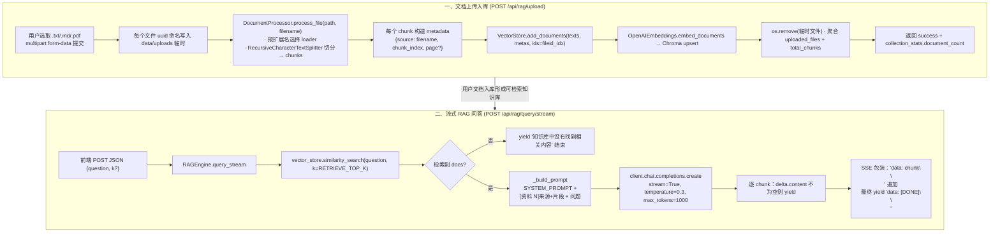

# 项目 3：RAG 知识库问答系统

> 项目源码：[fengnovo/llm-projects](https://github.com/fengnovo/llm-projects)

> 基础项目 · ChromaDB + LangChain + FastAPI

## 项目简介

一个完整的 RAG（检索增强生成）知识库问答系统，支持上传文档、向量化存储、基于文档内容的智能问答。

## 技术栈

**后端**
- FastAPI（Web 框架）
- LangChain（RAG 流程编排）
- ChromaDB（向量数据库，轻量级本地持久化）
- OpenAI Embedding（向量化）
- PyPDF（PDF 解析）

**前端**
- 纯 HTML/JS 单文件
- 支持文件上传、流式问答
- 知识库统计展示

## 核心功能

- ✅ 文档上传（支持 .txt / .md / .pdf）
- ✅ 文档切片（RecursiveCharacterTextSplitter）
- ✅ 向量化存储（ChromaDB 本地持久化）
- ✅ 相似度检索
- ✅ RAG 问答（流式 + 非流式）
- ✅ 引用来源展示
- ✅ 知识库管理（统计、清空）

## 快速开始

### 1. 启动后端

```bash
cd 03-rag-knowledge-base/backend

# 创建虚拟环境
python -m venv venv
source venv/bin/activate  # Windows: venv\Scripts\activate

# 安装依赖
pip install -r requirements.txt

# 配置环境变量
cp .env.example .env
# 编辑 .env，填入你的 API Key

# 启动服务
python -m app.main
```

服务启动在 http://localhost:8001

API 文档：http://localhost:8001/docs

### 2. 打开前端

直接用浏览器打开 `frontend/index.html`。

或者用 Python 起静态服务：
```bash
cd frontend
python -m http.server 3001
```

### 3. 测试

1. 上传 `sample_docs/` 目录下的示例文档（rag-intro.md、langchain-intro.md）
2. 试试问这些问题：
   - "什么是 RAG？"
   - "RAG 的基本流程是什么？"
   - "LangChain 的核心概念有哪些？"
   - "LangChain 和 LangGraph 有什么区别？"

## RAG 原理详解

### 整体流程

```
用户提问
   ↓
问题向量化（Embedding）
   ↓
向量数据库相似度检索
   ↓
拿到 Top-K 相关文档片段
   ↓
构建 Prompt：System + 参考资料 + 用户问题
   ↓
调用 LLM 生成回答
   ↓
返回回答 + 引用来源
```

### 文档切片策略

为什么要切片？
- LLM 的 Context 窗口有限
- 检索的粒度要合适：太粗找不到细节，太细丢失上下文

本项目用 `RecursiveCharacterTextSplitter`：
- 按换行符、句号、感叹号等分隔符递归切分
- 保证每个片段有一定的重叠（overlap），避免边界信息丢失
- 默认 500 字符一片段，重叠 50 字符

### 相似度检索

向量检索的本质：
- 把文本转成高维向量（比如 1536 维）
- 语义相似的文本，向量距离也近
- 用余弦相似度或欧氏距离衡量相似度

ChromaDB 默认用余弦相似度。

### 为什么 RAG 能减少幻觉？

- 模型回答时"开卷考试"，有参考资料
- Prompt 中明确要求"只根据参考资料回答，不知道就说不知道"
- 可以追溯答案来源，可解释性强

---

## 🧱 系统架构

```
        ┌───────────────────────────────────────────┐
        │          前端 frontend/index.html          │
        │  上传文档 · 知识库统计 · 流式问答 · 清空    │
        │  （默认 FastAPI 同源托管：http://host:8001/ ）│
        └───────────────┬───────────────────────────┘
                        │ fetch /api/rag/*
                        ▼
  ┌─────────────────────────────────────────────────────────────┐
  │ FastAPI (main.py · CORS allow_origins="*" · 同源托管静态页) │
  │                                                             │
  │ api/rag.py                                                  │
  │  POST  /upload        → 文件列表 → 文档处理 → 入库           │
  │  POST  /add-text      → 直接切片入库                         │
  │  POST  /query         → RAGEngine.query()                  │
  │  POST  /query/stream  → SSE (data: chunk\n\n)              │
  │  GET   /stats         → Chroma collection 统计               │
  │  DEL   /clear         → delete_collection                   │
  └──┬────────────────┬─────────────────────────┬───────────────┘
     ▼                ▼                         ▼
DocumentProcessor   RAGEngine              VectorStore
(文档处理模块)    (问答编排引擎)          (ChromaDB封装)
                   - SYSTEM_PROMPT            - get_vector_store()
                   - _build_context           - similarity_search
                   - _build_prompt            - add_documents
                   - query / query_stream     - get_collection_stats
                   - add_document              - delete_collection
     │                │                         │
     ▼                ▼                         ▼
  PyPDF +          AsyncOpenAI            Chroma PersistentClient
  langchain        (CHAT_MODEL ·           (embedding_function=
  TextSplitter     temperature=0.3)         OpenAIEmbeddings ·
  (chunk=500,                               check_embedding_ctx_length=False ·
   overlap=50)                             chunk_size=10 ·
     │                                     cosine相似度)
     ▼                                        │
 [资料 i] 来源：xxx（片段 N）                  ▼
  +  chunk元数据                     Chroma SQLite + parquet 持久化
     │                               路径：data/chroma/
     ▼
  UPLOAD_DIR 临时文件（处理完即 os.remove）
```

| 模块 | 文件 | 关键实现 |
|---|---|---|
| REST 接口 | `app/api/rag.py` | 上传走 `DocumentProcessor.process_file` + `vector_store.add_documents`（第 65-118 行）；流式走 `engine.query_stream` + `StreamingResponse`（第 42-62 行） |
| 文档处理器 | `app/document_processor.py` | `load_file` 按后缀分发（`.pdf`→PyPDF；`.txt/.md`→utf8 文本）；`RecursiveCharacterTextSplitter(chunk_size=CHUNK_SIZE, overlap=CHUNK_OVERLAP, 中文分隔符)` |
| RAG 引擎 | `app/rag_engine.py` | `SYSTEM_PROMPT` 明确禁止编造（第 24-37 行）；`_build_context` 标注"[资料 N] 来源+片段编号"（第 46-55 行）；`sources` 去重返回（第 114-120 行） |
| 向量库 | `app/vectorstore.py` | `Chroma(persist_directory, embedding_function=OpenAIEmbeddings(base_url, model, check_embedding_ctx_length=False))` |
| 配置 | `app/config.py` / `.env` | `CHUNK_SIZE / CHUNK_OVERLAP / RETRIEVE_TOP_K / EMBEDDING_MODEL / CHAT_MODEL` |

---

## 🔄 核心流程：上传文档 + 流式问答



**代码锚点与关键约定：**
- 上传接口入口 [rag.py:65-118](https://github.com/fengnovo/llm-projects/blob/main/03-rag-knowledge-base/backend/app/api/rag.py#L65-L118)：`file_id = uuid4()` + `os.remove(file_path)`（第 82/106 行），保证临时目录不堆积；返回体中 `success` 为 True、`message` 为"成功上传 N 个文件，共 M 个片段"（第 112 行）。
- 切片策略在 [document_processor.py:20-28](https://github.com/fengnovo/llm-projects/blob/main/03-rag-knowledge-base/backend/app/document_processor.py#L20-L28)：`separators` 显式加入中文标点 `。！？`，避免中英文混排的切分点错位。
- 检索与 Prompt 构造对应 [rag_engine.py:75-126](https://github.com/fengnovo/llm-projects/blob/main/03-rag-knowledge-base/backend/app/rag_engine.py#L75-L126)（非流式）/ [128-159](https://github.com/fengnovo/llm-projects/blob/main/03-rag-knowledge-base/backend/app/rag_engine.py#L128-L159)（流式），两条链路共用同一套 `_build_prompt → _build_context` 模板，保证回答一致性。
- 同源托管：[main.py:35-39](https://github.com/fengnovo/llm-projects/blob/main/03-rag-knowledge-base/backend/app/main.py#L35-L39) 挂载 `frontend/` 为静态根，访问 `http://host:8001/` 即可得到页面 + API 同域，消除跨域（前端 API_BASE 自适应，[index.html:266-270](https://github.com/fengnovo/llm-projects/blob/main/03-rag-knowledge-base/frontend/index.html#L266-L270)）。

---

## 可以优化的方向

### 1. 检索质量优化
- **混合检索**：BM25 关键词检索 + 向量检索，用 RRF 算法融合
- **Rerank 重排序**：用 BGE-Rerank 等模型对初筛结果重新排序
- **Query 改写**：用 LLM 把用户的问题改写得更适合检索
- **多路召回**：不同切片大小、不同 Embedding 模型多路召回再融合

### 2. 切片优化
- 语义切片（按语义段落切，不是按字符数）
- 父子文档策略（粗粒度检索，细粒度返回）
- 结构化切片（保留标题、层级信息）

### 3. 回答质量优化
- 答案校验（用另一个模型检查答案是否有依据）
- 多轮 RAG（根据历史对话优化检索）
- Self-RAG（模型自己判断要不要检索、检索什么）

### 4. 多模态扩展
- 图片向量化（CLIP 等多模态 Embedding 模型）
- 视频关键帧提取 + 向量化
- 表格解析（把表格转成结构化数据再检索）

### 5. 生产级改造
- 把 ChromaDB 换成 Milvus / Qdrant（支持大规模、分布式）
- 批量向量化（用队列异步处理）
- 缓存（常见问题的答案缓存）
- 监控（检索命中率、回答满意度等）

## 项目结构

```
03-rag-knowledge-base/
├── backend/
│   ├── app/
│   │   ├── main.py              # FastAPI 入口
│   │   ├── config.py            # 配置
│   │   ├── vectorstore.py       # 向量数据库封装
│   │   ├── document_processor.py # 文档处理（加载+切片）
│   │   ├── rag_engine.py        # RAG 引擎核心
│   │   └── api/
│   │       └── rag.py           # API 接口
│   ├── requirements.txt
│   └── .env.example
├── frontend/
│   └── index.html               # 前端 Demo
└── sample_docs/                 # 示例文档
    ├── rag-intro.md
    └── langchain-intro.md
```

- ✅ RAG 熟练工
- ✅ 向量数据库（ChromaDB 入门，可迁移到 Milvus/Qdrant）
- ✅ Embedding 原理
- ✅ 文档处理与切片
- ✅ LangChain 使用

## 和角色引擎项目结合

这个 RAG 系统可以直接集成到**项目 2（AI 角色引擎）**中：

- 角色的"知识库"：让角色记住设定好的背景知识
- 内容推荐：聊天时根据语境从多模态内容库中推荐图片/视频
- 长期记忆的向量检索：长期记忆太多时，用向量检索只召回相关的

这正好对应 JD 中的"私域内容多模态 RAG 系统"。

## 下一步

- 试试把 ChromaDB 换成 Qdrant 或 Milvus
- 加一个 Rerank 模块（比如 BGE-Reranker）
- 试试混合检索
- 研究多模态 RAG（图文混合检索）
