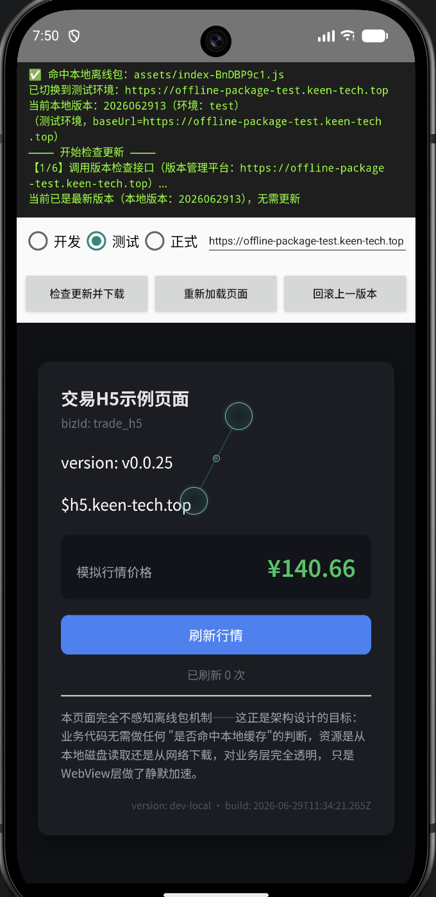
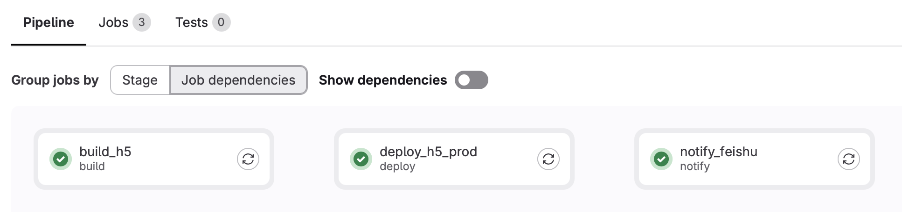
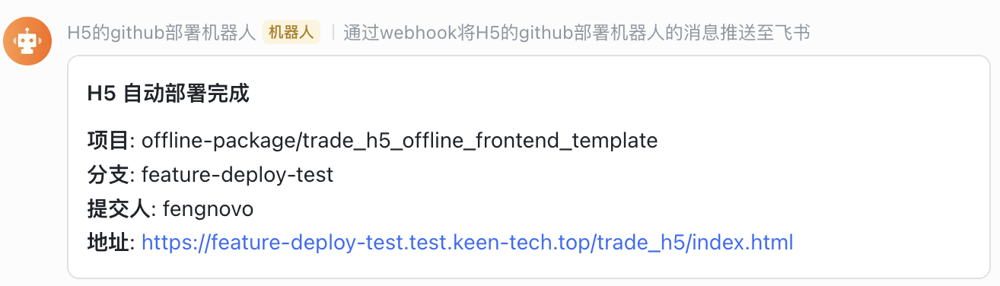

# 多分支自动部署转测：用泛域名给每个分支生成独立测试环境
git：
离线包管理平台：https://gitlab.com/offline-package/offline-package-platform  
h5页面：https://gitlab.com/offline-package/trade_h5_offline_frontend_template   
安卓项目：https://gitlab.com/offline-package/OfflinePackageAndroid  

正式环境： https://offline-package.keen-tech.top/  
测试环境：https://offline-package-test.keen-tech.top/  

H5 feature分支  https://feature-deploy-test.test.keen-tech.top/trade_h5/index.html  
Test-xxxx 分支  https://test.test.keen-tech.top/trade_h5/index.html 对应有离线包  
main/master分支 正式环境 https://h5.keen-tech.top/trade_h5/index.html 对应有离线包   

安卓体验包二维码：http://cdn.keen-tech.top/android-apks/app-debug-offline-v2.apk  
  
  

这篇单独聊 `trade_h5_offline_frontend` 里的多分支自动部署转测方案。

它解决的是一个很常见的协作问题：开发同学推了一个 `feature/xxx` 分支，测试同学不应该再问“你部署到哪了”“地址发我一下”“这个环境是不是最新”。这些事情应该由 CI 自动完成。

目标效果是：

```text
git push feature/pay-flow
  -> GitLab CI 自动构建
  -> dist/ 同步到 ECS 对应目录
  -> 生成 https://feature-pay-flow.test.keen-tech.top/trade_h5/index.html
  -> 注册测试离线包
  -> 飞书通知测试同学
```
在h5 页面自动化构建和打包的逻辑
```text
┌─────────────────┬─────────────────────────────────────────────┐
│      分支        │                效果                          │
├─────────────────┼─────────────────────────────────────────────┤
│ test / test-xxx │ 构建 + 部署 + 注册离线包到测试管理平台            │
├─────────────────┼─────────────────────────────────────────────┤
│ feature-xxx     │ 构建 + 部署，不注册离线包，不在管理平台           │
├─────────────────┼─────────────────────────────────────────── ─┤
│ main            │ 构建 + 部署到正式环境，+ 注册离线包到正式管理平台   │
└─────────────────┴─────────────────────────────────────────────┘
```
安卓加载离线包逻辑
```text
┌──────┬───────────────────────────────────────────┬───────────────────────────────────────┐
│ 环境 │                  H5 URL                   │              拦截器行为                 │
├──────┼───────────────────────────────────────────┼───────────────────────────────────────┤
│ 开发 │ http://10.0.2.2:5173/                     │ 不匹配任何前缀 → 走网络 → Vite 热更新      │
├──────┼───────────────────────────────────────────┼───────────────────────────────────────┤
│ 测试 │ https://test.test.keen-tech.top/trade_h5/ │ 匹配 TEST_PREFIX → 拦截 → 本地文件       │
├──────┼───────────────────────────────────────────┼───────────────────────────────────────┤
│ 正式 │ https://h5.keen-tech.top/trade_h5/        │ 匹配 CDN_PREFIX → 拦截 → 本地文件        │
└──────┴───────────────────────────────────────────┴───────────────────────────────────────┘
```
## 先用大白话理解

这套方案的核心不是“写一个复杂部署系统”，而是用几个简单规则把分支和测试环境对应起来。

<div class="lc-flow">
  <div class="lc-flow__node">
    <strong>分支名</strong>
    <span>feature/pay-flow 是开发同学正在做的需求。</span>
  </div>
  <div class="lc-flow__arrow">→</div>
  <div class="lc-flow__node">
    <strong>slug</strong>
    <span>GitLab 转成合法域名片段：feature-pay-flow。</span>
  </div>
  <div class="lc-flow__arrow">→</div>
  <div class="lc-flow__node">
    <strong>子域名</strong>
    <span>拼成 feature-pay-flow.test.keen-tech.top。</span>
  </div>
  <div class="lc-flow__arrow">→</div>
  <div class="lc-flow__node">
    <strong>服务器目录</strong>
    <span>Nginx 映射到 /data/test/feature-pay-flow。</span>
  </div>
  <div class="lc-flow__arrow">→</div>
  <div class="lc-flow__node">
    <strong>转测地址</strong>
    <span>测试直接打开 /trade_h5/index.html。</span>
  </div>
</div>

大白话说：分支名就是环境名，域名只是把它包装成一个能访问的地址，服务器目录就是这个环境的文件夹。

## offline-package 整体架构

`/Users/keen/Desktop/code/projects/offline-package` 下面其实是三套东西合在一起跑：

<div class="lc-protocol-grid">
  <div>
    <strong>trade_h5_offline_frontend</strong>
    <span>业务 H5 工程。负责 Vite build、生成 manifest、打 zip、注册版本、部署在线 H5。</span>
  </div>
  <div>
    <strong>offline-package-platform</strong>
    <span>版本管理平台。负责保存版本记录、灰度/全量/拉黑、给客户端提供 /check。</span>
  </div>
  <div>
    <strong>OfflinePackageAndroid</strong>
    <span>客户端 Demo。负责检查更新、下载 zip、校验、解压、原子切换、WebView 拦截。</span>
  </div>
  <div>
    <strong>2026062915</strong>
    <span>一份已经构建好的离线包样例，里面有 index.html、assets 和 manifest.json。</span>
  </div>
</div>

它们不是三个孤立 demo，而是一条完整的版本发布链路：

<div class="lc-flow">
  <div class="lc-flow__node">
    <strong>H5 构建产物</strong>
    <span>Vite 生成 dist，里面有 index.html、assets 和 manifest。</span>
  </div>
  <div class="lc-flow__arrow">→</div>
  <div class="lc-flow__node">
    <strong>版本注册</strong>
    <span>前端脚本把 zip 和 manifest 注册到版本管理平台。</span>
  </div>
  <div class="lc-flow__arrow">→</div>
  <div class="lc-flow__node">
    <strong>人工放量</strong>
    <span>平台后台把 draft 设置成灰度或全量。</span>
  </div>
  <div class="lc-flow__arrow">→</div>
  <div class="lc-flow__node">
    <strong>客户端检查</strong>
    <span>Android 请求 /check，判断有没有可更新版本。</span>
  </div>
  <div class="lc-flow__arrow">→</div>
  <div class="lc-flow__node">
    <strong>端上激活</strong>
    <span>下载、校验、解压、切到 active 后，WebView 命中本地资源。</span>
  </div>
</div>

这条链路里，平台是唯一状态源。前端只负责把版本交上来，客户端只相信平台 `/check` 返回的版本。灰度、全量、拉黑都不散落在 CI 或客户端里。

## 版本自动部署的主线

“多分支转测”只是在线 H5 的入口地址自动化；“版本自动部署”则是让这份构建产物自动进入版本系统。

完整主线可以这样看：

<div class="lc-sequence">
  <div>
    <b>CI 判断环境</b>
    <span>resolve-deploy-target.mjs 根据分支生成 DEPLOY_ENV、VITE_H5_CDN_BASE、PLATFORM_API_BASE。</span>
  </div>
  <div>
    <b>构建 H5</b>
    <span>Vite build 产出 dist，并把当前版本号注入页面。</span>
  </div>
  <div>
    <b>生成 manifest</b>
    <span>generateManifest() 扫描 dist，记录每个文件的 path、md5、size 和 packageMd5。</span>
  </div>
  <div>
    <b>打离线包</b>
    <span>zipPackage() 把 dist 整体压成 offline-dist/trade_h5-&lt;version&gt;.zip。</span>
  </div>
  <div>
    <b>注册版本</b>
    <span>uploadAndRegister() POST 到 /api/admin/offline-package/register。</span>
  </div>
  <div>
    <b>上线 H5</b>
    <span>同一份 dist rsync 到 Nginx 目录，给测试浏览器访问。</span>
  </div>
</div>

大白话说：CI 不是只把网页部署出去，它还顺手把同一份网页打包成“客户端可下载的版本”，登记到版本管理平台。

## 测试和正式平台要隔离

版本自动部署最怕“测试包进正式环境”。这个项目把平台也分成两套：

<div class="lc-map">
  <div>
    <strong>测试平台</strong>
    <span>https://offline-package-test.keen-tech.top，接收 feature/fix 分支的离线包。</span>
  </div>
  <div>
    <strong>正式平台</strong>
    <span>https://offline-package.keen-tech.top，只接收 main/master 的正式包。</span>
  </div>
  <div>
    <strong>Android 环境选择</strong>
    <span>开发、测试、正式对应不同 baseUrl，本地缓存目录也按环境隔离。</span>
  </div>
</div>

这意味着：

```text
feature/pay-flow
  -> H5 地址：https://feature-pay-flow.test.keen-tech.top/trade_h5/index.html
  -> 版本平台：https://offline-package-test.keen-tech.top

main
  -> H5 地址：https://h5.keen-tech.top/trade_h5/index.html
  -> 版本平台：https://offline-package.keen-tech.top
```

测试包和正式包分库、分目录、分平台，客户端也按环境请求对应 `/check`，这样不会把测试版本误下发到正式用户。

## 为什么用泛域名

如果不用泛域名，每新增一个分支环境，就要做三件麻烦事：

- 新增 DNS 解析。
- 新增 Nginx server 配置。
- reload Nginx。

这显然不适合 feature 分支。分支可能一天建很多个，也可能一周后就删了。

泛域名方案把这件事简化成：

<div class="lc-map">
  <div>
    <strong>DNS</strong>
    <span>配置 *.test.keen-tech.top A 记录，统一指向 ECS。</span>
  </div>
  <div>
    <strong>Nginx</strong>
    <span>用正则从 host 里提取 branch，root 指到对应目录。</span>
  </div>
  <div>
    <strong>CI</strong>
    <span>只负责把 dist/ 上传到 /data/test/&lt;branch&gt;/trade_h5。</span>
  </div>
</div>

这样新分支上线时不需要改基础设施，只要把文件放到正确目录。

## 域名怎么落到目录

方案文档里的 Nginx 关键配置是：

```nginx
server {
    listen 443 ssl;
    server_name ~^(?<branch>[a-z0-9-]+)\.test\.keen-tech\.top$;

    root /data/test/$branch;
    index index.html;

    location /trade_h5/ {
        try_files $uri $uri/ /trade_h5/index.html;
    }
}
```

请求路径会这样走：

<div class="lc-sequence">
  <div>
    <b>访问域名</b>
    <span>https://feature-pay-flow.test.keen-tech.top/trade_h5/index.html</span>
  </div>
  <div>
    <b>正则提取分支</b>
    <span>Nginx 从 host 中拿到 branch = feature-pay-flow。</span>
  </div>
  <div>
    <b>拼出 root</b>
    <span>root 变成 /data/test/feature-pay-flow。</span>
  </div>
  <div>
    <b>读取文件</b>
    <span>最终读取 /data/test/feature-pay-flow/trade_h5/index.html。</span>
  </div>
  <div>
    <b>SPA 兜底</b>
    <span>如果是业务子路由，try_files 回退到 /trade_h5/index.html。</span>
  </div>
</div>

这个设计最舒服的地方是：Nginx 只配置一次，以后新增分支只新增目录。

## CI 先算清楚部署目标

项目里有个脚本 `scripts/ci/resolve-deploy-target.mjs`，它专门把“当前分支”翻译成部署上下文。

它的判断规则很直接：

<div class="lc-protocol-grid">
  <div>
    <strong>main / master</strong>
    <span>正式环境，域名是 https://h5.keen-tech.top。</span>
  </div>
  <div>
    <strong>其他分支</strong>
    <span>测试环境，域名是 https://&lt;slug&gt;.test.keen-tech.top。</span>
  </div>
  <div>
    <strong>正式目录</strong>
    <span>/data/www/h5.keen-tech.top/trade_h5。</span>
  </div>
  <div>
    <strong>测试目录</strong>
    <span>/data/test/&lt;slug&gt;/trade_h5。</span>
  </div>
  <div>
    <strong>正式平台</strong>
    <span>https://offline-package.keen-tech.top。</span>
  </div>
  <div>
    <strong>测试平台</strong>
    <span>https://offline-package-test.keen-tech.top。</span>
  </div>
</div>

脚本会生成 `deploy.env`：

```text
DEPLOY_ENV=branch
DEPLOY_ENV_NAME=test/feature-pay-flow
DEPLOY_BRANCH_SLUG=feature-pay-flow
DEPLOY_ORIGIN=https://feature-pay-flow.test.keen-tech.top
DEPLOY_REMOTE_DIR=/data/test/feature-pay-flow/trade_h5
PLATFORM_API_BASE=https://offline-package-test.keen-tech.top
VITE_H5_CDN_BASE=https://feature-pay-flow.test.keen-tech.top/trade_h5/
APP_URL=https://feature-pay-flow.test.keen-tech.top/trade_h5/index.html
```

后续 job 都读这份文件。这样 build、部署、离线包注册、通知使用的是同一套变量，不会出现“构建用一个域名，通知发另一个域名”的错位。  
  

  

## 一份 dist 同时服务两件事

这个项目比较特殊，因为它既有在线 H5，也有 App 离线包。

所以同一份 `dist/` 在 CI 里会走两条路：

<div class="lc-flow">
  <div class="lc-flow__node">
    <strong>vite build</strong>
    <span>VITE_H5_CDN_BASE 注入当前分支 H5 base。</span>
  </div>
  <div class="lc-flow__arrow">→</div>
  <div class="lc-flow__node">
    <strong>在线 H5</strong>
    <span>rsync dist/ 到 Nginx 目录，测试浏览器直接访问。</span>
  </div>
  <div class="lc-flow__arrow">+</div>
  <div class="lc-flow__node">
    <strong>离线包</strong>
    <span>扫描 dist/ 生成 manifest，打 zip，上传测试版本平台。</span>
  </div>
  <div class="lc-flow__arrow">→</div>
  <div class="lc-flow__node">
    <strong>App 联调</strong>
    <span>客户端 /check 拿测试平台返回的分支包。</span>
  </div>
</div>

`scripts/ci/register.mjs` 就是为 CI 场景准备的。它和本地 `scripts/release.mjs` 的区别是：

<div class="lc-map">
  <div>
    <strong>不重复 build</strong>
    <span>CI 前面已经执行过 vite build，register 只复用 dist。</span>
  </div>
  <div>
    <strong>不删除 dist</strong>
    <span>后面的 deploy job 还要把 dist rsync 到服务器。</span>
  </div>
  <div>
    <strong>平台失败不阻塞</strong>
    <span>测试版本平台暂时不可用时，在线 H5 转测仍然可以继续。</span>
  </div>
</div>

这就是它比 `release.mjs` 更适合流水线的原因。

## 版本平台接住了什么

前端注册版本时，请求的是平台的管理接口：

```text
POST /api/admin/offline-package/register
```

它会带上这些信息：

<div class="lc-protocol-grid">
  <div>
    <strong>bizId</strong>
    <span>业务线标识，比如 trade_h5。</span>
  </div>
  <div>
    <strong>version</strong>
    <span>版本号，比如 2026062915 或 CI 生成的版本。</span>
  </div>
  <div>
    <strong>packageUrl</strong>
    <span>zip 下载地址；Demo 里也支持 multipart 直接上传 zip。</span>
  </div>
  <div>
    <strong>manifestJson</strong>
    <span>完整 manifest 内容，包含文件列表、md5、包大小。</span>
  </div>
  <div>
    <strong>packageMd5</strong>
    <span>整包内容指纹，客户端用来校验下载结果。</span>
  </div>
  <div>
    <strong>minAppVersion</strong>
    <span>最低 App 容器版本，不兼容的客户端不会拿到这个包。</span>
  </div>
</div>

平台收到后会做三件事：

<div class="lc-sequence">
  <div>
    <b>保存 zip 或登记外部地址</b>
    <span>有 file 就落到 storage，有 packageUrl 就登记 CDN 地址。</span>
  </div>
  <div>
    <b>保存 manifest</b>
    <span>单独写一份 &lt;version&gt;.manifest.json，方便客户端下载小文件。</span>
  </div>
  <div>
    <b>写版本记录</b>
    <span>upsertVersion() 写入 offline_package_version，初始状态是 draft。</span>
  </div>
</div>

注意初始状态是 `draft`，不会立刻下发。这样 CI 自动注册不会等于自动放量，中间还留了人工确认、灰度和回滚空间。

## 从 draft 到客户端更新

版本自动部署之后，还要经过版本状态机。

<div class="lc-flow">
  <div class="lc-flow__node">
    <strong>draft</strong>
    <span>刚注册，只在后台可见，/check 不会返回。</span>
  </div>
  <div class="lc-flow__arrow">→</div>
  <div class="lc-flow__node">
    <strong>gray</strong>
    <span>设置 grayPercent，只让部分 deviceId 命中。</span>
  </div>
  <div class="lc-flow__arrow">→</div>
  <div class="lc-flow__node">
    <strong>full</strong>
    <span>全量发布，gray_percent = 100。</span>
  </div>
  <div class="lc-flow__arrow">↘</div>
  <div class="lc-flow__node">
    <strong>blacklist</strong>
    <span>发现问题后拉黑，/check 立即跳过这个版本。</span>
  </div>
</div>

Android 客户端请求：

```text
GET /api/offline-package/v1/check?bizId=trade_h5&localVersion=0&deviceId=xxx&appVersion=1.0.0
```

平台会从新到旧找候选版本：

<div class="lc-sequence">
  <div>
    <b>只看 gray / full</b>
    <span>draft 和 blacklist 都不会进入候选列表。</span>
  </div>
  <div>
    <b>检查 App 兼容</b>
    <span>appVersion 必须满足 minAppVersion。</span>
  </div>
  <div>
    <b>判断灰度命中</b>
    <span>full 直接命中；gray 用 md5(deviceId) % 100 判断是否小于 grayPercent。</span>
  </div>
  <div>
    <b>比较本地版本</b>
    <span>候选 version 必须大于 localVersion，才返回 hasUpdate=true。</span>
  </div>
  <div>
    <b>返回下载信息</b>
    <span>返回 packageUrl、manifestUrl、packageMd5、packageSize。</span>
  </div>
</div>

这就是“版本自动部署”的闭环：CI 自动注册版本，平台人工控制放量，客户端按平台状态自动更新。

## 完整流水线怎么跑

把代码和方案合起来看，一条测试分支流水线可以拆成五步：

<div class="lc-sequence">
  <div>
    <b>resolve target</b>
    <span>执行 scripts/ci/resolve-deploy-target.mjs，生成 deploy.env。</span>
  </div>
  <div>
    <b>build H5</b>
    <span>加载 deploy.env，执行 vite build，产出 dist/。</span>
  </div>
  <div>
    <b>register offline package</b>
    <span>执行 scripts/ci/register.mjs，生成 manifest 和 zip，注册测试版本平台。</span>
  </div>
  <div>
    <b>deploy online H5</b>
    <span>rsync dist/ 到 DEPLOY_REMOTE_DIR。</span>
  </div>
  <div>
    <b>notify QA</b>
    <span>刷新环境总览页，并把 APP_URL 发到飞书群。</span>
  </div>
</div>

大白话说，流水线先问“我是谁，要去哪”，再构建，再一份给浏览器，一份给 App，最后把地址告诉测试。

## 缓存策略不能省

测试环境也要处理缓存，否则测试同学会遇到“你说部署了，但我刷新还是旧页面”。

Nginx 里建议这样分：

<div class="lc-map">
  <div>
    <strong>index.html</strong>
    <span>no-cache。入口文件要经常确认是否更新。</span>
  </div>
  <div>
    <strong>assets/</strong>
    <span>long cache + immutable。Vite 产物带 hash，内容变了文件名就变。</span>
  </div>
  <div>
    <strong>业务路由</strong>
    <span>try_files 回退 index.html，支持 React Router 这类 SPA 路由。</span>
  </div>
</div>

入口不缓存，静态资源长缓存，这是前端静态站最稳的组合。

## 总览页和自动清理

测试同学不一定记得每个分支的 slug，所以项目里放了 `deploy/server/generate_index.sh`。

它会扫描：

```text
/data/test/*/trade_h5/index.html
```

然后生成一个总览页：

```text
https://test.keen-tech.top
```

每个在线分支都会出现在列表里，点一下就能进入对应测试环境。

清理也有两层：

<div class="lc-protocol-grid">
  <div>
    <strong>GitLab auto_stop_in</strong>
    <span>环境一周不动后触发 stop job，删除对应目录。</span>
  </div>
  <div>
    <strong>服务器 crontab</strong>
    <span>每天清理 /data/test 下超过 7 天没更新的目录。</span>
  </div>
  <div>
    <strong>重新生成总览页</strong>
    <span>部署和清理后都执行 generate_index.sh，避免列表过期。</span>
  </div>
</div>

这里的双保险很重要。GitLab 管环境生命周期，服务器定时任务管磁盘空间。少一个都容易留下垃圾环境。

## 为什么这个方案适合转测

它的价值不只是“有一个链接”，而是把转测动作标准化了。

<div class="lc-map">
  <div>
    <strong>开发侧</strong>
    <span>只要 push 分支，不用手工部署，不用手工发包。</span>
  </div>
  <div>
    <strong>测试侧</strong>
    <span>收到固定格式的地址，或者从总览页自己找环境。</span>
  </div>
  <div>
    <strong>App 联调</strong>
    <span>同一份 dist 还能注册成测试离线包，客户端可以走 /check 拉包。</span>
  </div>
  <div>
    <strong>服务器侧</strong>
    <span>泛域名和正则 root 让新增环境不需要改 Nginx。</span>
  </div>
</div>

这套方案最值得保留的边界是：分支环境只是文件目录，不是基础设施配置。只要坚持这个边界，测试环境就能低成本地创建、访问和销毁。

最后更新：2026-03-05
