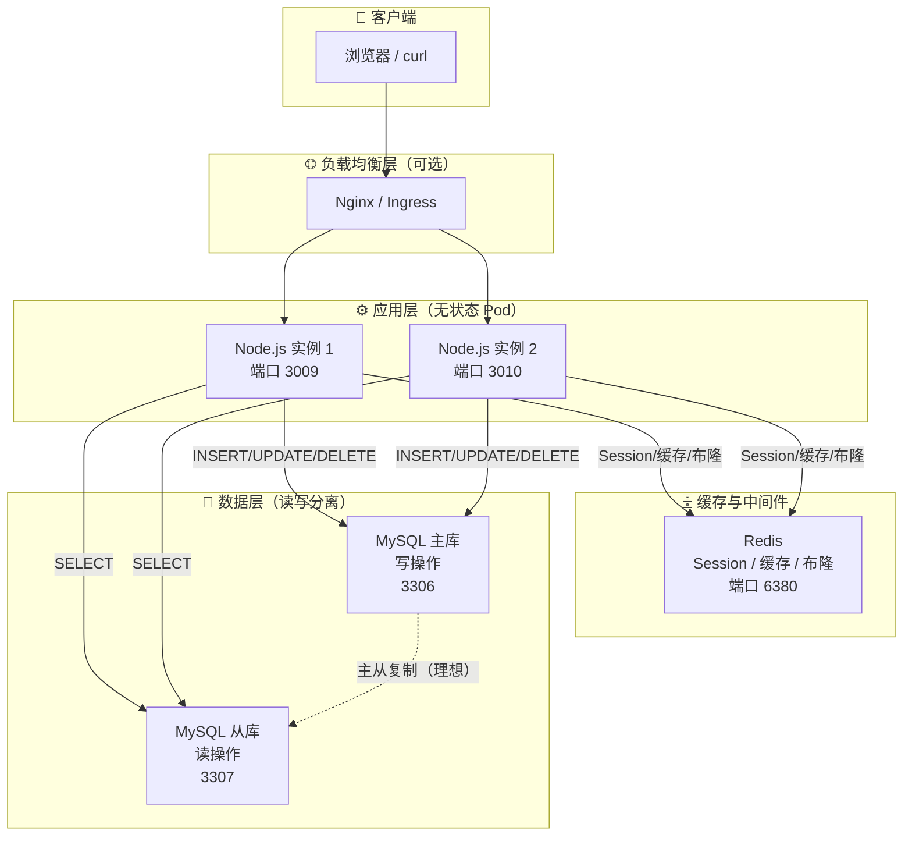
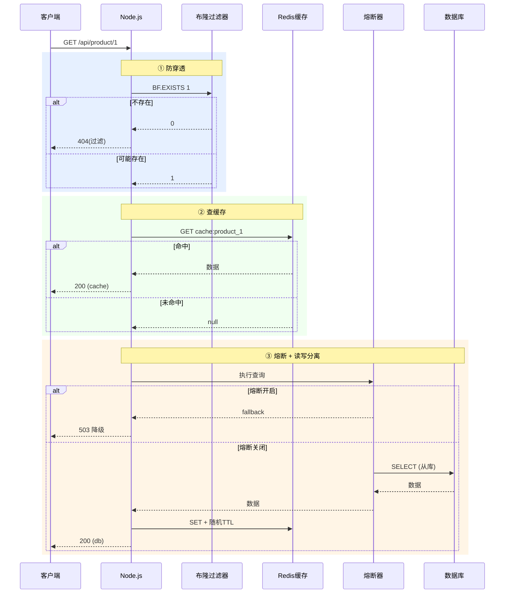
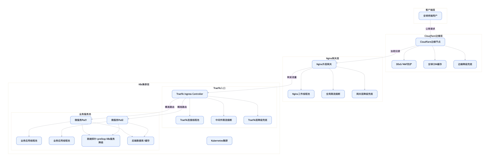
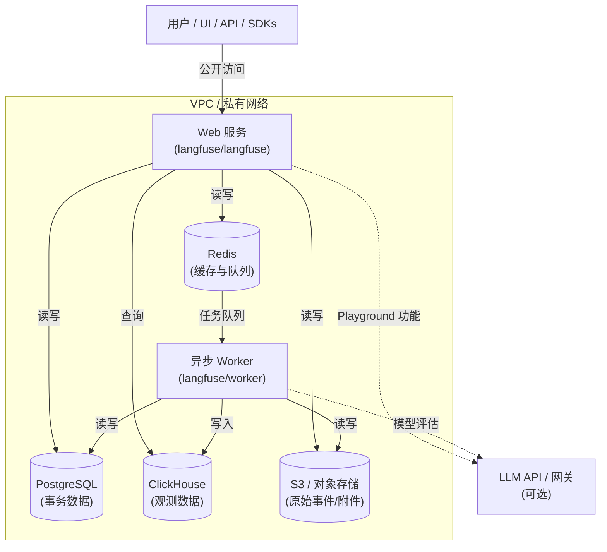
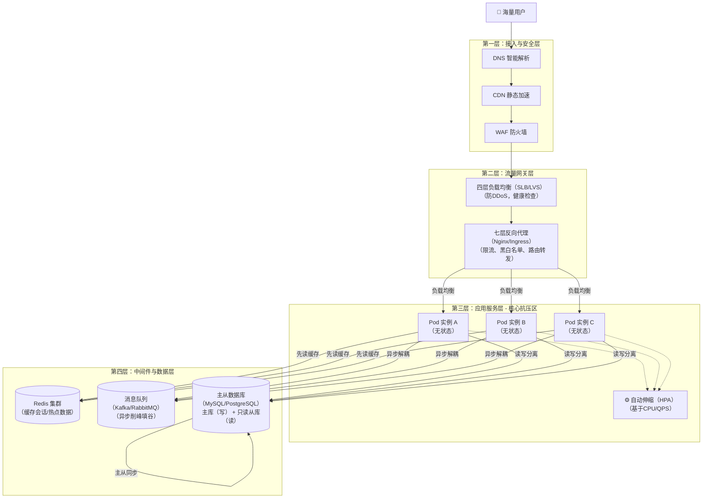
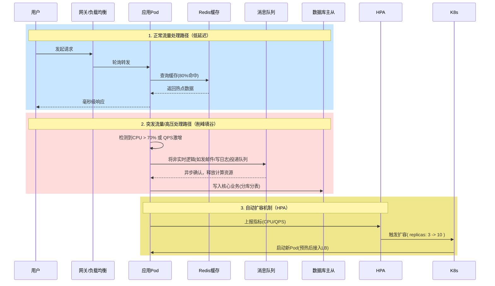

# Node.js 高可用实战：无状态、读写分离、缓存与熔断降级

GitHub：[https://github.com/fengnovo/stability-availability-nodejs](https://github.com/fengnovo/stability-availability-nodejs)

### 四大特性
| 压舱石 | 验证方法 |
| --- | --- |
| 无状态 | 启动多个 Node 实例（不同端口），登录后使用同一 cookie 访问任意实例，/api/profile 都能返回相同会话信息。 |
| 读写分离 | 观察应用日志或使用 docker logs 查看 MySQL 查询，SELECT 走 mysql_slave，INSERT/UPDATE 走 mysql_master。 |
| 防穿透 | 请求 /api/product/999999（不存在的 ID），返回 404 商品不存在(过滤)，且不查询数据库。 |
| 防雪崩 | 多个缓存 Key 的 TTL 随机偏移（基础 300s + 0~60s 随机），避免同时失效。 |
| 熔断降级 | 模拟数据库慢查询（如 SELECT SLEEP(5)），连续请求 5 次触发熔断，返回友好降级提示。 |

### 核心组件与“四大压舱石”对应关系
| 组件（文件路径） | 核心职责 | 对应压舱石 |
| --- | --- | --- |
| src/middleware/session.js | 将 Session 存储在 Redis，使应用无状态 | ✅ 无状态应用 |
| src/config/db.js | 根据 SQL 自动路由：写走主库，读走从库 | ✅ 读写分离 |
| src/services/bloom.js | 布隆过滤器，拦截不存在的 ID，防穿透 | ✅ 防缓存穿透 |
| src/services/cache.js | 缓存热点数据，随机 TTL 防雪崩 | ✅ 防缓存雪崩 |
| src/services/breaker.js | 熔断降级，包裹数据库查询，超时/失败时返回兜底 | ✅ 熔断降级 |
| src/routes/api.js | 串联所有组件，处理业务请求 | 整合层 |

### 目录结构
```
node-ha-demo/
├── .env
├── .env.example
├── package.json
├── docker-compose.yml
├── Dockerfile
└── src/
    ├── app.js
    ├── server.js
    ├── config/
    │   ├── db.js          # 读写分离连接池
    │   └── redis.js       # Redis 客户端（含密码）
    ├── services/
    │   ├── cache.js       # 缓存 + 随机TTL + 预热
    │   ├── bloom.js       # 布隆过滤器
    │   └── breaker.js     # 熔断器 + 降级
    ├── middleware/
    │   └── session.js     # Session 存储至 Redis
    └── routes/
        └── api.js         # 业务路由
```

### 架构流程图



### 请求处理流程图（/api/product/:id）


### 一键启动命令
```
# 1. 启动 MySQL 主从 + Redis
docker-compose up -d

# 2. 安装 Node 依赖
npm install

# 3. 创建数据库表（在主库和从库分别执行，保证读写分离测试）
docker exec -i node-ha-demo-mysql_master-1 mysql -uroot -p123456 test << 'EOF'
CREATE TABLE IF NOT EXISTS products (
  id INT PRIMARY KEY,
  name VARCHAR(100),
  price DECIMAL(10,2),
  stock INT
);
INSERT INTO products (id, name, price, stock) VALUES (1, 'Product A', 19.99, 100), (2, 'Product B', 29.99, 50);
EOF

docker exec -i node-ha-demo-mysql_slave-1 mysql -uroot -p123456 test << 'EOF'
CREATE TABLE IF NOT EXISTS products (
  id INT PRIMARY KEY,
  name VARCHAR(100),
  price DECIMAL(10,2),
  stock INT
);
INSERT INTO products (id, name, price, stock) VALUES (1, 'Product A', 19.99, 100), (2, 'Product B', 29.99, 50);
EOF

# 4. 启动应用
npm start
```

### breaker 熔断器状态机流转
```
关闭 ──(错误率≥50%)──▶ 打开 ──(10s后)──▶ 半开 ──(试探成功)──▶ 关闭
                                              └──(试探失败)──▶ 打开
```
 这是一个基于 opossum 库实现的数据库查询熔断器（Circuit Breaker），  
 属于高可用设计中的"熔断降级"模式。核心目的是：当数据库查询频繁失败或超时时，  
 自动切断请求并返回降级结果，防止故障蔓延导致雪崩。  

### bloom
```
请求 getProduct(id)
  ↓
exists(id) → false  → 直接返回"商品不存在"（防穿透）
  ↓ true
查缓存 → 命中 → 返回
  ↓ miss
查数据库 → 存在 → 回填缓存 + add(id) → 返回
         → 不存在 → 返回"商品不存在"
```
### cache
```
const randomOffset = Math.floor(Math.random() * 60);
// 实际 TTL = baseTTL + 随机偏移
```
防雪崩机制原理：如果 1000 个商品都设置 TTL=300s，它们会在第 300 秒同时失效，  
此时所有请求穿透到数据库形成"雪崩"。加上 0~60s 的随机偏移后，过期时间分散在 300~360s 之间，  
避免集中失效。

```
await set(k, { id: k, name: `Product_${k}`, warmup: true }, 600);
await bloom.add(k);
```
缓存预热: 服务启动时主动把热点 ID 写入缓存，用户首次访问即可命中缓存。  
同时调用 bloom.add(k) 把 ID 加入布隆过滤器，保证预热数据也能被防穿透逻辑正确识别。

统一前缀, 所有 key 都加 cache: 前缀，便于在 Redis 中通过 scan 按前缀批量清理或统计缓存。
```
cache.js
  ├── redis (存储后端)
  └── bloom.js (预热时同步写入布隆过滤器)
        ↑
  breaker.js (底层数据库查询的熔断器)
```
三个模块共同构成了完整的缓存高可用体系：  
布隆过滤器防穿透 → 随机 TTL 防雪崩 → 熔断器防数据库故障蔓延

cache.js 是基于 Redis 的缓存服务层，实现了两个高可用设计：
| 能力 | 解决的问题 | 实现方式 |
| --- | --- | --- |
| 防雪崩 | 大量缓存 key 同时过期，请求瞬间全部打到数据库 | TTL 叠加 0~60s 随机偏移 |
| 缓存预热 | 服务冷启动时缓存为空，数据库压力骤增 | 启动时批量加载热点数据到缓存 |


### session.js中间件
```
用户请求
   ↓
Session 中间件（Redis 共享存储）→ 所有实例可识别登录态
   ↓
业务逻辑（缓存 → 布隆过滤器 → 数据库 → 熔断器）
```
### db.js
是 MySQL 数据库的读写分离核心配置。通过维护主库（Master）和从库（Slave）两个独立连接池，  
将写操作路由到主库、读操作路由到从库，实现数据库层面的负载均衡和性能提升。
```
breaker.js（熔断器）
    ↓ 包裹
db.js（读写分离）→ Master（写）/ Slave（读）
```
breaker.js 中的 query 函数包裹的就是这里导出的 query，  
所以数据库层面有两道保障：读写分离提升性能 + 熔断器防止故障蔓延。

### app.js
| 顺序 | 中间件 | 为什么放这里 |
| --- | --- | --- |
| ① | `helmet()` | 必须最靠前，安全头要在任何响应发出前设置。如果放在路由后面，错误响应可能没有安全头 |
| ② | `compression()` | 放在 body 解析之前，因为它只处理响应，不关心请求体。放在前面可以尽早注册响应拦截 |
| ③ | `express.json()` | 必须在所有需要 `req.body` 的中间件之前。session 不需要 body，但路由需要 |
| ④ | `sessionMiddleware` | 放在路由之前，让业务代码能访问 `req.session` |
| ⑤⑥ | 路由 | 放在最后，前面的中间件都执行完才进入业务逻辑 |
### api.js
```
请求商品 ID
   ↓
① 布隆过滤器 exists(id)
   ├─ false → 404 拦截（防穿透，不查 DB）
   └─ true  ↓
② 查缓存 get(cacheKey)
   ├─ 命中 → 返回缓存数据（防击穿）
   └─ 未命中 ↓
③ executeQuery（熔断器 + 读写分离查从库）
   ├─ 熔断 → 降级返回 503
   ├─ 查不到 → 404（布隆误判）
   └─ 查到 ↓
④ 写缓存 set(cacheKey, data)（随机 TTL 防雪崩）
   ↓
返回数据
```

```
请求 → [helmet/compression/session] → 路由
  ├─ 读：bloom(防穿透) → cache(防击穿) → breaker+读写分离(防故障) → cache写回(防雪崩)
  ├─ 写：主库 → 删缓存
  └─ 登录：Redis Session（无状态）
```
当前 /order 没有鉴权是一个 Demo 简化。生产环境应该加一个鉴权中间件统一保护需要登录的路由：
```
// 鉴权中间件
const auth = (req, res, next) => {
  if (!req.session.user) {
    return res.status(401).json({ msg: '未登录' });
  }
  next();
};

// 只保护需要登录的路由
router.post('/order', auth, async (req, res) => { ... });
router.get('/profile', auth, (req, res) => { ... });
```
req.session.user 是从 Redis 取的吗？ 是的。  
请求进入时
```
客户端请求（Cookie 携带 session_id=abc123）
       ↓
sessionMiddleware 中间件执行
       ↓
① 从 Cookie 中解析出 session_id = "abc123"
       ↓
② 用 "sess:abc123" 作为 key 去 Redis 查询
       ↓
③ Redis 返回 JSON 字符串：'{"user":{"id":1,"name":"test_user"},"cookie":{...}}'
       ↓
④ 反序列化后挂到 req.session 上
       ↓
⑤ 路由中就能访问 req.session.user
```
请求结束时
```
路由处理完毕（中间件链走到末尾）
       ↓
express-session 检测 req.session 是否被修改
       ↓
如果修改过 → 序列化成 JSON → 写回 Redis（key 仍为 sess:abc123）
       ↓
同时 Set-Cookie 响应头返回新的 session_id（如果是新会话）
```
1. req.session 不是凭空来的，它是 sessionMiddleware 在每个请求开始时从 Redis 加载的
2. session_id 是桥梁：客户端 Cookie 存 session_id，Redis 用 sess:session_id 存 session 数据
3. 多实例共享：因为存在 Redis，无论请求落到哪个实例，都能用同一个 session_id 从 Redis 取到相同的 req.session.user
4. 登录时写入：POST /login 中 req.session.user = {...} 会在请求结束时被 express-session 自动写回 Redis   
所以可以理解为：req.session 就是 Redis 中那条 session 数据在内存中的代理对象，读是从 Redis 来，写会自动同步回 Redis。










高稳定性与高可用的 4 个“压舱石”, 以下具体策略：  
无状态应用（Stateless）：这是最重要的前提。所有Session（会话）存到Redis，文件存到OSS（对象存储）。应用本身不存任何持久化数据，这意味着K8s可以像捏橡皮泥一样随意捏合Pod数量，重启或崩溃都不会丢失状态。

数据库“读写分离 + 分库分表”：这是系统瓶颈所在。部署时必须配置1个主库（写） + N个只读从库（读）。网关层配置拦截器，读请求自动走从库，写请求走主库。流量再大，主库也不会因为复杂的查询SQL被拖垮。

缓存预热 + 布隆过滤器：Redis必须开启持久化（AOF/RDB）。为了防止缓存瞬间失效导致数据库被打死（缓存雪崩），必须给热点Key设置不同的随机过期时间，并利用布隆过滤器拦截掉不存在的Key查询（缓存穿透）。

熔断与降级：在网关层（Nginx/Spring Cloud Gateway）配置超时和重试。当下游数据库响应变慢时，直接返回兜底数据（比如“活动太火爆，请稍后再试”），而不是让线程池全部阻塞导致应用雪崩。  

核心原则: 应用容器化跑在K8s（无状态），数据库/缓存买云厂商托管服务（有状态）。

普通应用多了一层网关层（Nginx/Ingress），负责限流和路由分发，而Langfuse通常直接暴露Web端口。
普通应用极依赖Redis缓存来扛QPS，而Langfuse更依赖ClickHouse列式存储来扛海量写入。
